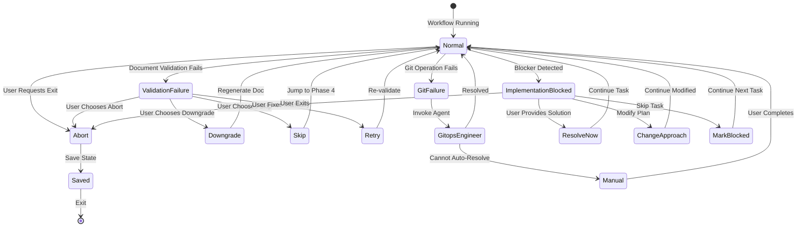

# Unified Shaping Workflow

## Overview

The unified shaping workflow provides a single entry point for transforming ideas into implementation. It replaces the separate `/brainstorm` and `/prd` commands with a streamlined process that automatically scales based on complexity.

**Command:** `/shape`

**Core Principle:** Right-size the process based on complexity. Complexity determines overhead, not ceremony.

## Workflow Overview

```
                              USER IDEA
                                  │
                                  ▼
                    ┌─────────────────────────┐
                    │   PHASE 0: COMPLEXITY   │
                    │   CHECK                 │
                    └───────────┬─────────────┘
                                │
          ┌─────────────────────┼─────────────────────┐
          ▼                     ▼                     ▼
       TRIVIAL               SIMPLE               COMPLEX
          │                     │                     │
          │                     ▼                     ▼
          │         ┌───────────────────┐ ┌───────────────────┐
          │         │ PHASE 1: SIMPLE   │ │ PHASE 2: COMPLEX  │
          │         │ DISCOVERY         │ │ DISCOVERY         │
          │         │ • Core (3-10 Q)   │ │ • Deep understand │
          │         │ • Edge (3-8 Q)    │ │ • Alternatives    │
          │         │ • Evaluate        │ │ • Edge cases      │
          │         └─────────┬─────────┘ │ • Gap analysis    │
          │                   │           └─────────┬─────────┘
          │                   │                     │
          │         ┌─────────┴─────────────────────┘
          │         │
          │         ▼
          │  ┌─────────────────────────┐
          │  │ PHASE 3: DOCUMENTATION  │
          │  │ DECISION                │
          │  │ • Design Doc (SIMPLE)   │
          │  │ • PRD (COMPLEX)         │
          │  │ • Skip option           │
          │  └───────────┬─────────────┘
          │              │
          │         ┌────┴────┐
          │         │         │
          │      Document   Skip
          │         │         │
          │         ▼         │
          │  ┌────────────┐   │
          │  │ Validate & │   │
          │  │ Git Commit │   │
          │  └─────┬──────┘   │
          │        │          │
          │        ▼          │
          │  ┌────────────┐   │
          │  │ PHASE 4:   │   │
          │  │ WORKSPACE  │   │
          │  │ (parked)   │   │
          │  └─────┬──────┘   │
          │        │          │
          └────────┼──────────┘
                   │
                   ▼
        ┌─────────────────────────┐
        │ PHASE 5: IMPLEMENTATION │
        │ HANDOFF                 │
        └───────────┬─────────────┘
                    │
      ┌─────────────┼─────────────┐
      ▼             ▼             ▼
   DIRECT      GUIDED PLAN   TASK-MASTER
  (TRIVIAL)     (SIMPLE)      (COMPLEX)
      │             │             │
      ▼             ▼             ▼
   ┌─────────────────────────────────┐
   │ ALL PATHS ENFORCE:              │
   │ • TDD (mandatory)               │
   │ • Code Review (mandatory)       │
   │ • Requirement Verification      │
   │ • gitops-engineer for git ops   │
   └─────────────────────────────────┘
```

---

# Phase 0: Complexity Check

## Purpose

Determine the appropriate process depth based on the user's request. This is the entry point for all shaping workflows.

**Position in Workflow:** Entry point → Classification → Route to appropriate phase

## Complexity Classifications

The workflow supports three complexity levels, each triggering a different process depth:

### TRIVIAL

**Definition:** Straightforward changes with no ambiguity or risk.

**Characteristics (ALL must be true):**
- Single file OR 2 tightly coupled files
- No new logic branches
- No user-facing behavior change (or purely cosmetic)
- No data model impact
- Clear, unambiguous request

**Action:** Skip entire discovery workflow, proceed directly to Phase 5 (Direct Implementation)

**Examples:**
- Fix typo in error message
- Rename variable for clarity
- Update hardcoded constant
- Fix formatting issue

---

### SIMPLE

**Definition:** Well-understood features with limited scope and clear boundaries.

**Characteristics:**
- 3-5 estimated files
- 0-1 new components
- Single feature or flow
- No external integrations
- Minor or no data model changes
- Low uncertainty

**Action:** Phase 1 (Simple Discovery) → Phase 3 (Documentation Decision) → Phase 5 (Guided Plan)

**Examples:**
- Add validation to existing form
- Modify existing API endpoint
- Change UI component behavior
- Add new configuration option

---

### COMPLEX

**Definition:** Features requiring architectural thinking, multiple components, or significant integration.

**Characteristics:**
- 6+ estimated files OR unknown scope
- 2+ new components
- External integrations
- Schema or data model changes
- Multiple user-facing flows
- High uncertainty ("not sure", "maybe", "depends")

**Action:** Phase 2 (Complex Discovery) → Phase 3 (PRD) → Phase 5 (Task-Master)

**Examples:**
- Design authentication system
- Build integration with external API
- Migrate database schema
- Create multi-step workflow

---

## Auto-Detection Signals

The system analyzes the user's request against seven signals to determine complexity. Each signal contributes to the overall classification.

| Signal | TRIVIAL | SIMPLE | COMPLEX |
|--------|---------|--------|---------|
| **Scope language** | "fix", "typo", "rename" | "add", "change", "modify" | "design", "build", "integrate", "migrate" |
| **Estimated files** | 1-2 | 3-5 | 6+ or unknown |
| **New components** | 0 | 0-1 | 2+ |
| **External integrations** | 0 | 0 | 1+ |
| **Data model changes** | None | Minor | Schema changes |
| **User-facing changes** | None/cosmetic | Single flow | Multiple flows |
| **Uncertainty words** | No | Low | High ("not sure", "maybe", "depends") |

### Signal Weighting

Not all signals carry equal weight:

**High Weight (2 points):**
- External integrations
- Data model changes (schema)
- Uncertainty words (high)

**Medium Weight (1 point):**
- Estimated files (6+)
- New components (2+)
- User-facing changes (multiple flows)

**Low Weight (0.5 points):**
- Scope language
- Single metrics within thresholds

**Classification Logic:**
- **TRIVIAL:** Score = 0 AND all TRIVIAL criteria met
- **SIMPLE:** Score 0.5-2.5
- **COMPLEX:** Score ≥ 3.0 OR any single high-weight signal

---

## User Override and Classification Source

Users can override auto-detected classification at any point. The system tracks the source of the classification for transparency.

### Override Rules

| From | Can Override To | Notes |
|------|-----------------|-------|
| TRIVIAL | SIMPLE | User indicates more complexity than detected |
| SIMPLE | TRIVIAL | User confirms it's simpler than assessed |
| SIMPLE | COMPLEX | User reveals hidden complexity |
| COMPLEX | SIMPLE | User wants lighter process (not recommended) |

**Important:** COMPLEX cannot de-escalate to TRIVIAL (too risky to skip discovery entirely).

### Classification Source Tracking

The `classification_source` field tracks how the complexity was determined:

| Source | Meaning |
|--------|---------|
| `"auto"` | System auto-detected based on signals |
| `"user"` | User explicitly specified or confirmed |
| `"escalated"` | User overrode to higher complexity |
| `"de-escalated"` | User overrode to lower complexity |

**Example State:**
```
classification: SIMPLE
classification_source: "escalated"
```
Interpretation: System detected TRIVIAL, user escalated to SIMPLE.

---

## Output Format

When Phase 0 completes, the system presents its analysis and seeks confirmation:

### Example Output (SIMPLE Classification)

```
Analyzing your request...

Detected signals:
• Scope: "add validation to checkout form" → SIMPLE
• Files: ~4 (form component, validation logic, tests, types)
• New components: 0 (modifying existing form)
• Integrations: 0
• Data model: None

Initial assessment: SIMPLE

Proceed with light discovery (Phase 1), or adjust classification?
```

### Example Output (COMPLEX Classification)

```
Analyzing your request...

Detected signals:
• Scope: "integrate payment processing" → COMPLEX
• Files: ~8+ (payment service, webhooks, models, migrations, UI, tests)
• New components: 2+ (payment service, webhook handler)
• Integrations: 1 (Stripe API)
• Data model: Schema changes (payment tables)
• Uncertainty: High ("depends on payment provider features")

Initial assessment: COMPLEX

Proceed with full discovery (Phase 2), or adjust classification?
```

### Example Output (TRIVIAL Classification)

```
Analyzing your request...

Detected signals:
• Scope: "fix typo in error message" → TRIVIAL
• Files: 1 (error constants file)
• New components: 0
• Integrations: 0
• Data model: None
• User-facing: Cosmetic only

Initial assessment: TRIVIAL

This looks straightforward. Proceeding with direct implementation (Phase 5).
```

### Confirmation Prompts

| Classification | Prompt | Options |
|----------------|--------|---------|
| TRIVIAL | "Proceeding with direct implementation." | User can say "wait, this is more complex" to escalate |
| SIMPLE | "Proceed with light discovery, or adjust?" | "proceed", "actually it's trivial", "this is complex" |
| COMPLEX | "Proceed with full discovery, or adjust?" | "proceed", "keep it simple", "abort" |

---

## Phase Transitions

Phase 0 has three possible exit paths based on the final classification:

### Exit 1: TRIVIAL → Phase 5 (Direct Implementation)

| Attribute | Value |
|-----------|-------|
| **Trigger** | All TRIVIAL criteria met |
| **Guard** | Single file OR 2 tightly coupled files AND no new logic branches AND no user-facing behavior change AND no data model impact AND clear request |
| **Action** | Set `classification = TRIVIAL`, `classification_source = "auto"`, `implementation_path = "direct"` |
| **State Updates** | `WorkflowState.classification = TRIVIAL`<br>`WorkflowState.classification_source = "auto"`<br>`WorkflowState.implementation_path = "direct"` |
| **Output** | "This looks straightforward. Proceeding with direct implementation." |
| **Next Phase** | Phase 5 (Direct Implementation) |

**Rationale:** Skip discovery entirely when request is unambiguous and low-risk.

---

### Exit 2: SIMPLE → Phase 1 (Simple Discovery)

| Attribute | Value |
|-----------|-------|
| **Trigger** | SIMPLE signals detected, TRIVIAL criteria not met |
| **Guard** | 3-5 estimated files OR 0-1 new components OR scope language matches SIMPLE |
| **Action** | Set `classification = SIMPLE`, `classification_source = "auto"` |
| **State Updates** | `WorkflowState.classification = SIMPLE`<br>`WorkflowState.classification_source = "auto"`<br>`WorkflowState.implementation_path = "guided_plan"` |
| **Output** | "Initial assessment: SIMPLE. Proceeding with light discovery (Phase 1)." |
| **Next Phase** | Phase 1 (Simple Discovery) |

**Rationale:** Light discovery process to understand requirements without heavy overhead.

---

### Exit 3: COMPLEX → Phase 2 (Complex Discovery)

| Attribute | Value |
|-----------|-------|
| **Trigger** | COMPLEX signals detected |
| **Guard** | 6+ files OR 2+ new components OR external integrations OR schema changes OR uncertainty words |
| **Action** | Set `classification = COMPLEX`, `classification_source = "auto"` |
| **State Updates** | `WorkflowState.classification = COMPLEX`<br>`WorkflowState.classification_source = "auto"`<br>`WorkflowState.implementation_path = "task_master"` |
| **Output** | "Initial assessment: COMPLEX. Proceeding with full discovery and design (Phase 2)." |
| **Next Phase** | Phase 2 (Complex Discovery) |

**Rationale:** Full discovery required for features with significant complexity, integration, or uncertainty.

---

## State Preserved Across Transitions

When transitioning from Phase 0, the following state is established:

```typescript
WorkflowState {
    // Set in Phase 0
    classification: TRIVIAL | SIMPLE | COMPLEX
    classification_source: "auto" | "user" | "escalated" | "de-escalated"
    implementation_path: "direct" | "guided_plan" | "task_master"

    // Initialized for next phase
    created_at: timestamp
    updated_at: timestamp
    phase_history: [
        { phase: "phase_0", entered_at: timestamp, exited_at: timestamp }
    ]
}
```

---

## Detection Algorithm (Pseudocode)

```python
def detect_complexity(user_request: str) -> Classification:
    signals = {
        'scope_language': analyze_scope_words(user_request),
        'estimated_files': estimate_file_count(user_request),
        'new_components': estimate_component_count(user_request),
        'external_integrations': detect_integrations(user_request),
        'data_model_changes': detect_schema_changes(user_request),
        'user_facing_changes': analyze_ui_changes(user_request),
        'uncertainty_words': detect_uncertainty(user_request)
    }

    score = calculate_weighted_score(signals)

    # TRIVIAL: Must meet ALL criteria
    if score == 0 and meets_all_trivial_criteria(signals):
        return Classification(
            level=TRIVIAL,
            source="auto",
            implementation_path="direct"
        )

    # COMPLEX: Any high-weight signal or score threshold
    if score >= 3.0 or has_high_weight_signal(signals):
        return Classification(
            level=COMPLEX,
            source="auto",
            implementation_path="task_master"
        )

    # SIMPLE: Default middle ground
    return Classification(
        level=SIMPLE,
        source="auto",
        implementation_path="guided_plan"
    )

def confirm_with_user(classification: Classification) -> Classification:
    """
    Present classification and allow user to override.
    Updates classification_source if user changes it.
    """
    user_response = prompt_user(classification)

    if user_response.override:
        return Classification(
            level=user_response.new_level,
            source=determine_source(classification.level, user_response.new_level),
            implementation_path=get_implementation_path(user_response.new_level)
        )

    return classification
```

---

## User Experience Examples

### Example 1: Auto-Detected TRIVIAL (Accepted)

**User:** "Fix the typo in the login error message"

**System:**
```
Analyzing your request...

Detected signals:
• Scope: "fix typo" → TRIVIAL
• Files: 1 (likely error constants)
• New components: 0
• Integrations: 0

Initial assessment: TRIVIAL

This looks straightforward. Proceeding with direct implementation (Phase 5).
```

**Next:** Phase 5 (Direct Implementation)

---

### Example 2: Auto-Detected SIMPLE (Escalated by User)

**User:** "Add email validation to the signup form"

**System:**
```
Analyzing your request...

Detected signals:
• Scope: "add validation" → SIMPLE
• Files: ~3-4
• New components: 0

Initial assessment: SIMPLE

Proceed with light discovery (Phase 1), or adjust classification?
```

**User:** "Actually, this needs to integrate with an email verification service"

**System:**
```
Updated assessment: COMPLEX (escalated due to external integration)

Proceeding with full discovery (Phase 2).
```

**Next:** Phase 2 (Complex Discovery)

---

### Example 3: Auto-Detected COMPLEX (De-Escalated by User)

**User:** "Build a notification system"

**System:**
```
Analyzing your request...

Detected signals:
• Scope: "build system" → COMPLEX
• Files: Unknown (likely 10+)
• New components: 3+ (notification service, UI, persistence)
• Integrations: Possible (email, push)

Initial assessment: COMPLEX

Proceed with full discovery (Phase 2), or adjust classification?
```

**User:** "Keep it simple - just in-app toasts for now, no persistence"

**System:**
```
Updated assessment: SIMPLE (de-escalated to lighter process)

Proceeding with light discovery (Phase 1).
```

**Next:** Phase 1 (Simple Discovery)

---

## Quick Reference

### When to Use Each Classification

| Classification | Use When |
|----------------|----------|
| **TRIVIAL** | Request is crystal clear, single file, no risk, cosmetic/trivial change |
| **SIMPLE** | Feature is understood, limited scope, no integrations, low risk |
| **COMPLEX** | Architecture needed, integrations required, multiple flows, high uncertainty |

### Red Flags for Escalation

Watch for these signals that indicate higher complexity than initially detected:

- User says "depends on", "not sure", "maybe"
- Mentions external services/APIs
- Talks about "migration" or "refactor"
- Describes multiple user flows
- References schema/database changes
- Estimates "probably 10+ files"

### Green Flags for De-Escalation

Signals that complexity might be lower than detected:

- User provides exact file paths
- Says "just needs..." or "only affects..."
- Confirms "no integrations"
- Specifies "cosmetic only"
- Describes single, isolated change

---

## Next Steps

After Phase 0 completes:

| Classification | Next Phase | Documentation |
|----------------|------------|---------------|
| TRIVIAL | Phase 5 (Direct) | None |
| SIMPLE | Phase 1 (Simple Discovery) | Design Doc (Phase 3) |
| COMPLEX | Phase 2 (Complex Discovery) | PRD (Phase 3) |

**Note:** Phases 1 and 2 will be documented in subsequent sections of this skill.

---

# Natural Language Detection

## Purpose

Enable workflow invocation through natural language without requiring the explicit `/shape` command. The system detects user intent and automatically invokes the unified shaping workflow when appropriate, reducing friction while avoiding false positives.

**Key Principle:** Be helpful but not presumptuous. High-confidence triggers invoke immediately, medium-confidence triggers confirm first, and negative triggers are respected.

---

## High-Confidence Triggers (Invoke Immediately)

When these patterns are detected, immediately invoke the unified shaping workflow without confirmation. The user's language clearly indicates they want discovery and planning.

| Category | Patterns | Rationale |
|----------|----------|-----------|
| **Shaping language** | "help me shape...", "let's shape...", "shape this..." | Explicit mention of shaping process |
| **Explicit process** | "let's brainstorm...", "help me think through...", "walk me through building..." | User requests collaborative discovery |
| **Planning intent** | "help me plan...", "figure out how to...", "scope out..." | User acknowledges need for planning |
| **Uncertainty + scope** | "I'm not sure how to approach...", "what's the best way to build...", "how should we architect..." | High uncertainty signals need for discovery |
| **Complexity acknowledgment** | "this is a big change...", "major refactor...", "complex feature...", "non-trivial..." | User recognizes complexity upfront |
| **Documentation intent** | "I need a PRD for...", "write a spec for...", "document the requirements for...", "create a design doc for..." | Explicit request for design documentation |

**Action:** Invoke `unified-shaping-workflow` skill immediately and proceed to Phase 0 (Complexity Check).

**Example User Messages:**
- "Help me shape a notification system for the app"
- "Let's brainstorm how to implement authentication"
- "I'm not sure how to approach this refactoring"
- "This is a complex feature - let me walk you through what I need"
- "I need a PRD for the new dashboard"

---

## Medium-Confidence Triggers (Confirm Before Invoking)

When these patterns are detected, ask for user confirmation before invoking the workflow. These patterns suggest the user might benefit from discovery, but they could also have a plan already.

| Pattern | Confirmation Prompt | Rationale |
|---------|---------------------|-----------|
| "I want to build..." | "This sounds like it needs some shaping. Want to walk through discovery first?" | Building suggests new feature, but user might have clear plan |
| "Add a [feature]..." | "Should we scope this out first, or dive straight in?" | "Add" could be SIMPLE or COMPLEX |
| "Implement..." | "Do you have a plan already, or should we shape this first?" | Implementation could follow existing plan |
| "Create a new..." | "Is this straightforward, or should we think it through first?" | New component might need design |
| "New feature:" | "Want to run through discovery, or is this well-defined?" | Feature could be well-understood or vague |

**Action:** Present context-specific confirmation prompt and wait for user response.

**Example Interactions:**

**User:** "I want to build a search feature"
**System:** "This sounds like it needs some shaping. Want to walk through discovery first, or do you have a plan already?"
**User:** "Let's shape it" → Invoke workflow
**User:** "I have a plan, just do it" → Skip workflow, proceed to implementation

---

## Negative Triggers (Skip Workflow)

When these patterns are detected, do NOT invoke the workflow. The user wants immediate action, has a clear solution, or is performing a command/maintenance task.

| Pattern | Action | Rationale |
|---------|--------|-----------|
| "fix this bug...", "quick fix...", "hotfix..." | Direct implementation (TRIVIAL) | Bug fixes rarely need discovery |
| "rename...", "update the typo...", "change X to Y" | Direct implementation (TRIVIAL) | Trivial refactoring, no ambiguity |
| "just do...", "just add...", "simply..." | Direct implementation (user wants speed) | "Just" signals user wants action, not discussion |
| Explicit file paths provided | Direct implementation (user knows target) | User already knows what to change |
| "run...", "execute...", "build the project" | Command execution, not feature work | Not a feature request |
| Code snippets provided | User has solution, wants implementation | User already has the code |
| "following the plan...", "per the PRD..." | Implementation phase, not discovery | Plan already exists |

**Action:** Proceed directly to appropriate implementation path (usually Phase 5 Direct Implementation).

**Example User Messages:**
- "Fix the bug in src/auth/login.ts line 42"
- "Just add a console.log to debug this"
- "Rename getUserData to fetchUserData"
- "Run the test suite"
- "Following the plan we discussed, implement the auth service"

---

## Detection Priority and Algorithm

The detection system follows a strict priority order to minimize false positives and respect user intent.

### Priority Order

```
1. Check for NEGATIVE triggers first → Skip workflow
2. Check for HIGH-CONFIDENCE triggers → Invoke workflow
3. Check for MEDIUM-CONFIDENCE triggers → Confirm with user
4. Default → Do not invoke (avoid false positives)
```

**Rationale:** Negative triggers take precedence because they represent explicit user intent to skip discovery. Better to under-trigger than over-trigger.

---

### Detection Algorithm (Pseudocode)

```python
def detect_workflow_trigger(user_message: str) -> TriggerDecision:
    """
    Analyzes user message to determine if and how to invoke the unified shaping workflow.

    Returns:
        TriggerDecision with fields:
            - invoke: bool (true/false/"confirm")
            - confidence: str ("high"/"medium"/"none")
            - reason: str (explanation for decision)
    """

    # ===================================================================
    # PRIORITY 1: Negative triggers (skip workflow)
    # ===================================================================
    negative_patterns = [
        # Bug fixing language
        r"\b(fix|hotfix|bugfix)\b.*\b(bug|issue|error)\b",

        # Trivial changes
        r"\b(rename|typo|spelling)\b",

        # "Just do it" language
        r"\bjust\s+(do|add|change|update|fix)\b",
        r"\bquick(ly)?\s+(fix|change|update)\b",
        r"\bsimply\s+",

        # Command execution
        r"^(run|execute|build|test|lint)\s+",

        # Following existing plan
        r"following the (plan|PRD|spec)",
        r"per the (plan|PRD|spec|design doc)",

        # File paths (indicates user knows target)
        r"\b(src|lib|app|components)/[\w/]+\.(ts|js|py|go|rs)",

        # Code snippets provided
        r"```[\w]*\n"
    ]

    if matches_any(user_message, negative_patterns):
        return TriggerDecision(
            invoke=false,
            confidence="none",
            reason="negative_trigger_detected"
        )

    # ===================================================================
    # PRIORITY 2: High-confidence triggers (invoke immediately)
    # ===================================================================
    high_confidence_patterns = [
        # Explicit shaping language
        r"\b(help me |let's |let us )shape\b",

        # Discovery process requests
        r"\bbrainstorm\b",
        r"\bthink through\b",
        r"\bwalk me through\b",

        # Planning language
        r"\bfigure out how\b",
        r"\bscope (out|this)\b",
        r"\bplan (out|this)\b",

        # Uncertainty markers
        r"\bnot sure how to approach\b",
        r"\bbest way to (build|implement|create)\b",
        r"\bhow should (we|I) (architect|structure|approach)\b",

        # Complexity acknowledgment
        r"\b(big|major|complex|non-trivial) (change|refactor|feature)\b",

        # Documentation requests
        r"\b(need|create|write) a (PRD|spec|design doc)\b",
        r"\bdocument the requirements\b"
    ]

    if matches_any(user_message, high_confidence_patterns):
        return TriggerDecision(
            invoke=true,
            confidence="high",
            reason="high_confidence_pattern_matched"
        )

    # ===================================================================
    # PRIORITY 3: Medium-confidence triggers (confirm with user)
    # ===================================================================
    medium_confidence_patterns = [
        # Building language
        r"\b(I want to |we need to )build\b",

        # Feature additions
        r"\badd a .*(feature|capability|system)\b",

        # Implementation language (might follow plan)
        r"\bimplement\b.*\b(new|feature|system)\b",

        # New component creation
        r"\bcreate a new\b",
        r"\bnew feature\b"
    ]

    if matches_any(user_message, medium_confidence_patterns):
        return TriggerDecision(
            invoke="confirm",
            confidence="medium",
            reason="medium_confidence_pattern_matched",
            confirmation_prompt=generate_confirmation_prompt(user_message)
        )

    # ===================================================================
    # DEFAULT: Do not invoke (avoid false positives)
    # ===================================================================
    return TriggerDecision(
        invoke=false,
        confidence="none",
        reason="no_trigger_pattern_matched"
    )


def matches_any(message: str, patterns: list[str]) -> bool:
    """Check if message matches any pattern in the list (case-insensitive)."""
    message_lower = message.lower()
    for pattern in patterns:
        if regex_search(pattern, message_lower, flags=IGNORECASE):
            return true
    return false


def generate_confirmation_prompt(message: str) -> str:
    """Generate context-specific confirmation prompt based on detected pattern."""

    if contains(message, "build"):
        return "This sounds like it could benefit from some shaping. Walk through discovery first, or dive in?"

    if contains(message, "add a feature"):
        return "Should we scope this out, or is it straightforward enough to start coding?"

    if contains(message, "implement"):
        return "Do you have a plan for this, or should we shape it first?"

    if contains(message, "create a new") or contains(message, "new feature"):
        return "Want to run through discovery to define this, or is it already well-understood?"

    # Default confirmation
    return "Should we shape this first, or proceed directly to implementation?"
```

---

## Confirmation Prompts and Context

When medium-confidence triggers fire, use contextual confirmation prompts that respect the user's time and provide clear options.

### Context-Specific Prompts

| Detected Pattern | Confirmation Prompt | Accept Responses | Reject Responses |
|------------------|---------------------|------------------|------------------|
| "build" + feature scope | "This sounds like it could benefit from some shaping. Walk through discovery first, or dive in?" | "discovery", "let's shape it", "walk through it" | "dive in", "just start", "skip it" |
| "add a feature" | "Should we scope this out, or is it straightforward enough to start coding?" | "scope it", "yes", "let's scope" | "start coding", "no", "skip" |
| "implement" without plan reference | "Do you have a plan for this, or should we shape it first?" | "shape it", "no plan", "let's plan" | "have a plan", "yes", "proceed" |
| "new feature" | "Want to run through discovery to define this, or is it already well-understood?" | "discovery", "define it", "yes" | "well-understood", "no", "skip" |

**Principles:**
- **Respect user's time:** Make it easy to say "no"
- **Clear options:** Present "shape" vs "implement" as explicit choices
- **Context awareness:** Tailor prompt to the specific request
- **No pressure:** Neutral tone, not pushing for workflow invocation

---

## Integration Notes

### Skill Invocation

When a trigger fires, invoke the `unified-shaping-workflow` skill:

```typescript
// High-confidence trigger
if (trigger.confidence === "high") {
    invoke_skill("unified-shaping-workflow", {
        initial_message: user_message,
        trigger_source: "natural_language_high_confidence"
    })
}

// Medium-confidence trigger (after user confirms)
if (trigger.confidence === "medium" && user_confirms()) {
    invoke_skill("unified-shaping-workflow", {
        initial_message: user_message,
        trigger_source: "natural_language_medium_confidence"
    })
}
```

---

### Context Preservation

Pass the original user message to Phase 0 for complexity detection:

```typescript
WorkflowState {
    initial_request: user_message,
    trigger_source: "natural_language" | "explicit_command",
    detected_at: timestamp
}
```

This allows Phase 0 to perform its own complexity analysis without losing the original user intent.

---

### Override Respect

If the user responds to a confirmation prompt with rejection language, respect their preference:

**Rejection Language:**
- "just do it"
- "skip discovery"
- "I have a plan"
- "dive straight in"
- "no, implement now"

**Action:** Set `classification = TRIVIAL` (or let Phase 0 detect), proceed to Phase 5 (Direct Implementation).

---

### Learning and Refinement

Track trigger decisions to improve pattern accuracy over time:

```typescript
TriggerLog {
    timestamp: datetime,
    user_message: string,
    trigger_decision: TriggerDecision,
    user_response: "accepted" | "rejected" | "ignored",
    final_outcome: "workflow_completed" | "workflow_skipped" | "direct_implementation"
}
```

**Analysis:**
- High false positive rate on pattern X → Downgrade to medium-confidence
- High false negative rate → Add new pattern to high-confidence
- User consistently rejects medium-confidence trigger → Remove pattern

---

## Examples

### Example 1: High-Confidence Trigger (Invoke Immediately)

**User:** "Help me shape an authentication system for the app"

**System Detection:**
```
Pattern matched: r"\b(help me |let's )shape\b"
Confidence: HIGH
Decision: Invoke workflow immediately
```

**System Response:**
```
Invoking unified shaping workflow...

Analyzing your request...

Detected signals:
• Scope: "authentication system" → COMPLEX
• Files: Unknown (likely 10+)
• New components: 3+ (auth service, middleware, UI)
• Integrations: Possible (OAuth, session storage)

Initial assessment: COMPLEX

Proceed with full discovery (Phase 2), or adjust classification?
```

---

### Example 2: Medium-Confidence Trigger (Confirm First)

**User:** "I want to build a search feature"

**System Detection:**
```
Pattern matched: r"\b(I want to )build\b"
Confidence: MEDIUM
Decision: Confirm before invoking
```

**System Response:**
```
This sounds like it could benefit from some shaping. Walk through discovery first, or dive in?
```

**User:** "Let's shape it"

**System:**
```
Invoking unified shaping workflow...

Analyzing your request...
[Proceeds to Phase 0]
```

---

### Example 3: Negative Trigger (Skip Workflow)

**User:** "Fix the bug in src/auth/login.ts where the password validation is broken"

**System Detection:**
```
Pattern matched: r"\b(fix)\b.*\b(bug)\b"
Confidence: NONE (negative trigger)
Decision: Skip workflow, direct implementation
```

**System Response:**
```
I'll fix the password validation bug in src/auth/login.ts.

Let me examine the file first...
[Proceeds directly to bug fix implementation]
```

---

### Example 4: No Trigger (Default Behavior)

**User:** "What's the status of the test suite?"

**System Detection:**
```
Pattern matched: None
Confidence: NONE
Decision: Do not invoke workflow
```

**System Response:**
```
Let me check the test suite status for you.
[Runs test commands and reports results]
```

---

## Quick Reference

### Decision Tree

```
User Message
    │
    ├─ Contains negative trigger? → Skip workflow
    │
    ├─ Contains high-confidence trigger? → Invoke workflow immediately
    │
    ├─ Contains medium-confidence trigger? → Confirm with user
    │       │
    │       ├─ User confirms → Invoke workflow
    │       └─ User rejects → Skip workflow
    │
    └─ No trigger detected → Do not invoke workflow (default)
```

### Pattern Summary

| Trigger Type | Action | Examples |
|--------------|--------|----------|
| **Negative** | Skip workflow | "fix bug", "just do it", "run tests" |
| **High-Confidence** | Invoke immediately | "help me shape", "let's brainstorm", "not sure how to approach" |
| **Medium-Confidence** | Confirm first | "I want to build", "add a feature", "implement" |
| **No Trigger** | Do not invoke | General questions, status checks, conversations |

---

# Phase 1: Simple Discovery

## Purpose

Quick discovery for SIMPLE classification with emphasis on edge case detection. This lightweight process helps teams understand requirements and identify potential complexity without the overhead of full discovery.

**Position in Workflow:** SIMPLE classification → Phase 1 → Phase 3 (Documentation Decision)

**Key Principle:** Fast discovery with quality gates. Detect complexity early through targeted edge case probing.

---

## Flow Diagram

```
SIMPLE PATH ENTRY
       │
       ▼
Step 1: Core Understanding (3-10 questions)
       │
       ▼
Step 2: Edge Case Probing (3-8 questions)
       │
       ▼
Step 3: Complexity Evaluation
       │
       ├─── ALL N/A ──────► Offer TRIVIAL escape
       │
       ├─── 0 Triggers ───► Continue SIMPLE
       │
       └─── 1+ Triggers ──► Recommend ESCALATION to COMPLEX
                                    │
                            User choice:
                            • ESCALATE (recommended)
                            • FORCE SIMPLE (accept risk)
```

---

## Step 1: Core Understanding

**Purpose:** Gather essential information to understand the request without heavy ceremony.

**Question Count:** 3-10 (adaptive based on responses)

**Principle:** Ask just enough to understand the feature. Stop when clarity is achieved.

### Question Categories

| Category | Core Question | Purpose |
|----------|---------------|---------|
| **Problem** | "What problem does this solve?" | Understand the "why" behind the request |
| **Users** | "Who uses this?" | Identify stakeholders and personas |
| **Success** | "How will you know it worked?" | Define success criteria |
| **Constraints** | "What can't change?" | Identify non-negotiables and boundaries |
| **Context** | "What exists today?" | Understand current state and integration points |

### Adaptive Questioning

**Reduce questions when:**
- User provides detailed initial description
- Request is well-scoped and specific
- Minimal dependencies or integrations
- Clear success criteria stated upfront

**Increase questions when:**
- Vague or ambiguous request
- Multiple stakeholders mentioned
- Integration points unclear
- Success criteria undefined

### Example: Core Understanding Session (4 questions)

**User Request:** "Add email validation to the signup form"

**Q1 (Problem):** "What problem does this solve?"
**A1:** "Users are entering invalid email addresses and we can't reach them for verification."

**Q2 (Success):** "How will you know it worked?"
**A2:** "The form rejects invalid emails and shows a helpful error message."

**Q3 (Context):** "What exists today?"
**A3:** "We have a signup form in React, no validation yet."

**Q4 (Constraints):** "What can't change?"
**A4:** "Form layout must stay the same, just add inline validation."

**Result:** 4 questions were sufficient. User provided clear answers, no uncertainty detected.

---

## Step 2: Edge Case Probing

**Purpose:** Systematically probe for edge cases to prevent bugs and surface hidden complexity.

**Question Count:** 3-8 (adaptive based on relevance)

**Principle:** Not all edge cases apply to every feature. Ask only relevant categories.

### Edge Case Categories

| Category | Example Question | When to Ask |
|----------|------------------|-------------|
| **Invalid Input** | "What if input is empty, malformed, or unexpected?" | Any user input or data processing |
| **Failure Modes** | "What if this operation fails partway through?" | Any I/O, network, or external dependency |
| **Boundaries** | "Are there limits? What happens at 0, 1, max?" | Numeric input, collections, pagination |
| **Concurrency** | "Could this be triggered multiple times simultaneously?" | State changes, async operations |
| **Permissions** | "Who can do this? What if they lack permission?" | User actions, data access |
| **Missing State** | "What state must exist first? What if it's missing?" | State-dependent operations |
| **Side Effects** | "Does this affect anything else in the system?" | State mutations, notifications |
| **Recovery** | "Is this reversible? What's the undo path?" | Destructive actions, data changes |

### Adaptive Edge Case Selection

**Ask 3 questions when:**
- Feature is isolated with no dependencies
- Single code path, no state changes
- Read-only operation or purely cosmetic

**Ask 5-6 questions when:**
- Feature involves user input
- State changes or data persistence
- Error handling required

**Ask 7-8 questions when:**
- Multiple integration points
- Concurrent operations possible
- Permissions or security relevant

### Example: Edge Case Probing Session (5 questions)

**User Request:** "Add email validation to the signup form"

**Q1 (Invalid Input):** "What if input is empty or malformed?"
**A1:** "Show inline error: 'Please enter a valid email address.'"

**Q2 (Boundaries):** "Is there a max email length?"
**A2:** "Standard email max is 254 characters, we'll use that."

**Q3 (Failure Modes):** "What if validation regex fails?"
**A3:** "Shouldn't happen, but we can catch and log the error."

**Q4 (Side Effects):** "Does this affect existing user data?"
**A4:** "No, only for new signups."

**Q5 (Recovery):** "Can users submit the form with invalid email?"
**A5:** "No, submission is blocked until valid."

**Skipped Categories:**
- Concurrency: N/A (client-side validation only)
- Permissions: N/A (public signup form)
- Missing State: N/A (no dependencies)

**Result:** 5 relevant edge cases identified, 3 skipped as not applicable.

---

## Step 3: Complexity Evaluation

**Purpose:** Detect hidden complexity through user responses and decide whether to escalate.

**Principle:** Surface uncertainty early. 1+ escalation trigger = recommend COMPLEX.

### Escalation Triggers

Watch for these signals in user responses during Steps 1 and 2:

| Trigger Category | Pattern Examples | What It Signals |
|------------------|------------------|-----------------|
| **Uncertainty** | "not sure", "maybe", "depends", "I think", "probably" | Incomplete understanding |
| **Missing Capability** | "we don't have", "would need to build", "doesn't exist yet" | Requires new infrastructure |
| **Multiple Paths** | "if X then... but if Y then...", "it depends on..." | Complex conditional logic |
| **External Dependency** | "need to check with", "depends on [other system]", "API call to..." | Integration complexity |
| **Data Complexity** | "migration", "schema change", "database update" | High-risk data operations |
| **Compliance/Security** | "audit", "GDPR", "permission", "sensitive", "PII" | Regulatory requirements |
| **Scope Creep** | "also need to", "that reminds me", "while we're at it" | Expanding requirements |

**Evaluation Rule:** Presence of 1+ triggers = recommend escalation to COMPLEX.

### Example: Trigger Detection

**User Request:** "Add email validation to the signup form"

**Response Analysis:**
```
Q: "What if validation regex fails?"
A: "Shouldn't happen, but we can catch and log the error."
   → No trigger (clear answer)

Q: "Does this affect existing user data?"
A: "No, only for new signups."
   → No trigger (definitive answer)

Q: "Can users submit the form with invalid email?"
A: "No, submission is blocked until valid."
   → No trigger (clear behavior)
```

**Trigger Count:** 0
**Decision:** Continue with SIMPLE classification

---

**Counter-Example: Trigger Detection**

**User Request:** "Add email validation to the signup form"

**Response Analysis:**
```
Q: "What if input is empty or malformed?"
A: "Hmm, not sure. Maybe show an error? Depends on the design system."
   → Trigger: Uncertainty ("not sure", "maybe", "depends")

Q: "Does this affect existing user data?"
A: "We might need to validate existing emails too. Need to check with the product team."
   → Trigger: Scope creep ("might need to")
   → Trigger: External dependency ("need to check with")

Q: "Is there a max email length?"
A: "I think 254, but we'd need to add that to the database schema."
   → Trigger: Uncertainty ("I think")
   → Trigger: Data complexity ("database schema")
```

**Trigger Count:** 5
**Decision:** Recommend escalation to COMPLEX

---

## Outcomes and Transitions

Phase 1 has four distinct exit paths based on the complexity evaluation.

### Outcome 1: TRIVIAL Escape

**Condition:** All edge case answers are "N/A" or "doesn't apply"

**Example:**
```
User confirms all edge cases are not applicable:
• Invalid Input: N/A (hardcoded value)
• Failure Modes: N/A (no I/O)
• Boundaries: N/A (no limits)
• Concurrency: N/A (read-only)
• Permissions: N/A (public)
• Missing State: N/A (no dependencies)
• Side Effects: N/A (isolated)
• Recovery: N/A (no changes)
```

**System Response:**
```
Edge case analysis reveals this is simpler than initially assessed.
All edge cases are not applicable.

Recommendation: Downgrade to TRIVIAL and proceed directly to implementation.

Accept downgrade?
```

**If User Accepts:**
- Classification: TRIVIAL
- Classification Source: "de-escalated"
- Next Phase: Phase 5 (Direct Implementation)

---

### Outcome 2: Continue SIMPLE

**Condition:** 0 escalation triggers detected during Steps 1-2

**Example:**
```
Core understanding complete: ✓
Edge cases identified: 5
Escalation triggers detected: 0

All questions answered with clarity and confidence.
No uncertainty, external dependencies, or scope creep detected.
```

**System Response:**
```
Discovery complete. This remains SIMPLE.

Edge cases well-defined. Proceeding to documentation decision (Phase 3).
```

**State Passed to Phase 3:**
- `classification: SIMPLE`
- `core_understanding: {...}`
- `edge_cases: [{...}]`
- `escalation_triggers: []`

**Next Phase:** Phase 3 (Documentation Decision)

---

### Outcome 3: Escalate to COMPLEX

**Condition:** 1+ escalation triggers detected AND user accepts escalation

**Example:**
```
Discovery findings:
• Core understanding: Complete
• Edge cases identified: 6
• Escalation triggers detected: 3
  - Uncertainty: "not sure about error handling"
  - External dependency: "need to check with payment API"
  - Data complexity: "might need schema migration"

Recommendation: This is more complex than initially assessed.
Escalate to COMPLEX for full discovery and design process.
```

**System Response:**
```
Complexity detected during discovery.

Triggers:
• Uncertainty in error handling approach
• External dependency on payment API
• Potential schema migration required

Recommendation: Escalate to COMPLEX for thorough design.

Proceed with escalation?
```

**If User Accepts:**
- Classification: COMPLEX
- Classification Source: "escalated"
- State Preservation: All Phase 1 state is passed to Phase 2
- Next Phase: Phase 2, Step 2 (skip Deep Understanding, reuse Phase 1 data)

**If User Rejects:**
- See Outcome 4 (Force SIMPLE)

---

### Outcome 4: Force SIMPLE (Acknowledged Risks)

**Condition:** 1+ escalation triggers detected AND user explicitly chooses to force SIMPLE

**Example:**
```
Escalation triggers detected: 3
User response: "I know there's complexity, but we need to move fast. Keep it SIMPLE."
```

**System Response:**
```
Proceeding with SIMPLE classification.

Acknowledged risks:
• Uncertainty in error handling approach
• External dependency on payment API
• Potential schema migration required

These risks will be documented in the design doc.
Proceeding to documentation phase.
```

**State Passed to Phase 3:**
- `classification: SIMPLE`
- `core_understanding: {...}`
- `edge_cases: [{...}]`
- `escalation_triggers: [...]` (logged as acknowledged risks)
- `forced_simple: true`

**Next Phase:** Phase 3 (Documentation Decision)

**Note:** Acknowledged risks MUST be included in documentation as "Known Risks" section.

---

## Phase Transitions Summary

### Internal Step Progression

| Transition | Trigger | Guard | Action | State Updated |
|------------|---------|-------|--------|---------------|
| **Step 1 → Step 2** | Core understanding complete | 3-10 questions answered | Store `core_understanding` | `core_understanding: {...}` |
| **Step 2 → Step 3** | Edge case probing complete | 3-8 questions answered | Store `edge_cases` | `edge_cases: [{...}]` |

---

### Exit Transitions

#### Exit 1: Phase 1 → TRIVIAL Escape (to Phase 5)

| Attribute | Value |
|-----------|-------|
| **Trigger** | All edge case answers are N/A or "doesn't apply" |
| **Guard** | User confirms downgrade |
| **Action** | Set `classification = TRIVIAL`, `classification_source = "de-escalated"` |
| **Output** | "All edge cases not applicable. Downgrading to TRIVIAL." |
| **State Passed** | `classification`, `core_understanding` |
| **Next Phase** | Phase 5 (Direct Implementation) |

---

#### Exit 2: Phase 1 → Continue SIMPLE (to Phase 3)

| Attribute | Value |
|-----------|-------|
| **Trigger** | 0 escalation triggers detected |
| **Guard** | Edge case probing complete |
| **Action** | Finalize discovery state |
| **Output** | "Edge cases well-defined. Proceeding to documentation." |
| **State Passed** | `classification`, `core_understanding`, `edge_cases` |
| **Next Phase** | Phase 3 (Documentation Decision) |

---

#### Exit 3: Phase 1 → ESCALATE to COMPLEX (to Phase 2)

| Attribute | Value |
|-----------|-------|
| **Trigger** | 1+ escalation triggers detected |
| **Guard** | User accepts escalation recommendation |
| **Action** | Set `classification = COMPLEX`, `classification_source = "escalated"`, preserve discovery state |
| **Output** | "Complexity detected. Escalating to full design process." |
| **State Passed** | All Phase 1 state (reused in Phase 2) |
| **Next Phase** | Phase 2, Step 2 (skip Deep Understanding if already gathered) |

---

#### Exit 4: Phase 1 → FORCE SIMPLE (to Phase 3)

| Attribute | Value |
|-----------|-------|
| **Trigger** | 1+ escalation triggers detected |
| **Guard** | User explicitly chooses to force SIMPLE |
| **Action** | Log triggers as acknowledged risks |
| **Output** | "Proceeding with SIMPLE. Acknowledged risks: [triggers]" |
| **State Passed** | `classification`, `core_understanding`, `edge_cases`, `escalation_triggers` |
| **Next Phase** | Phase 3 (Documentation Decision) |

---

## State Preserved Across Transitions

When transitioning from Phase 1, the following state is established and passed to the next phase:

```typescript
WorkflowState {
    // From Phase 0
    classification: SIMPLE | TRIVIAL | COMPLEX  // May change during Phase 1
    classification_source: "auto" | "escalated" | "de-escalated"
    implementation_path: "direct" | "guided_plan" | "task_master"

    // Set in Phase 1
    core_understanding: {
        problem: string,
        users: string,
        success_criteria: string,
        constraints: string,
        context: string
    }
    edge_cases: [
        {
            category: string,
            question: string,
            answer: string,
            applicable: boolean
        }
    ]
    escalation_triggers: [
        {
            trigger_type: string,
            detected_in: string,  // Which question/answer
            quote: string         // Exact user text that triggered
        }
    ]
    forced_simple: boolean  // True if user forced SIMPLE despite triggers

    // Metadata
    phase_history: [
        { phase: "phase_0", entered_at: timestamp, exited_at: timestamp },
        { phase: "phase_1", entered_at: timestamp, exited_at: timestamp }
    ]
}
```

---

## Quick Reference

### When to Use Phase 1

| Scenario | Use Phase 1? |
|----------|--------------|
| Classification = SIMPLE | Yes (entry point) |
| Classification = TRIVIAL | No (skip to Phase 5) |
| Classification = COMPLEX | No (skip to Phase 2) |
| User escalates from TRIVIAL to SIMPLE | Yes |

---

### Step Duration Guidelines

| Step | Target Duration | Adaptive Range |
|------|-----------------|----------------|
| Step 1: Core Understanding | 5-10 minutes | 3-15 minutes |
| Step 2: Edge Case Probing | 5-8 minutes | 3-12 minutes |
| Step 3: Complexity Evaluation | 2 minutes | 1-5 minutes |
| **Total Phase 1** | **12-20 minutes** | **7-32 minutes** |

**Principle:** Fast discovery. If exceeding 30 minutes, likely misclassified as SIMPLE.

---

### Red Flags for Escalation

Immediately recommend escalation if user says:
- "This affects multiple systems"
- "We need to migrate data"
- "I'm not sure how [critical component] works"
- "This touches [payment/auth/security]"
- "We'll need to coordinate with [other team]"
- "Schema changes required"

---

### Green Flags for TRIVIAL Downgrade

Offer downgrade if user confirms:
- "All edge cases are N/A"
- "This is purely cosmetic"
- "No error handling needed"
- "Read-only operation"
- "Single file change"
- "No state changes"

---

## User Experience Examples

### Example 1: Successful SIMPLE Discovery (Continue to Phase 3)

**User:** "Add a character counter to the bio field"

**Phase 1 Discovery:**

**Step 1: Core Understanding (4 questions)**
```
Q: What problem does this solve?
A: Users don't know they're approaching the 280 character limit.

Q: Who uses this?
A: Any user editing their profile bio.

Q: How will you know it worked?
A: Counter updates in real-time as they type, shows "X/280".

Q: What exists today?
A: Bio field exists, no counter, backend has 280 char limit.
```

**Step 2: Edge Case Probing (4 questions)**
```
Q: What if input is empty?
A: Show "0/280".

Q: What happens at 280 characters exactly?
A: Show "280/280" and prevent further input.

Q: What if they paste text over the limit?
A: Truncate to 280 and show error message.

Q: Does this affect existing bios?
A: No, only enforces on edit.
```

**Step 3: Complexity Evaluation**
```
Escalation triggers detected: 0
All questions answered with clarity.
No uncertainty, dependencies, or scope creep.
```

**System:**
```
Discovery complete. Classification remains SIMPLE.

Proceeding to documentation decision (Phase 3).
```

---

### Example 2: Escalation to COMPLEX

**User:** "Add two-factor authentication to login"

**Phase 1 Discovery:**

**Step 1: Core Understanding (5 questions)**
```
Q: What problem does this solve?
A: Account security. Users need stronger protection.

Q: Who uses this?
A: All users, but maybe optional at first? Not sure.
   → Trigger: Uncertainty ("maybe", "not sure")

Q: How will you know it worked?
A: Users can enable 2FA and login with it.

Q: What can't change?
A: Existing login flow for users who don't enable it.

Q: What exists today?
A: Email/password auth. No 2FA system at all.
   → Trigger: Missing capability ("no 2FA system")
```

**Step 2: Edge Case Probing (6 questions)**
```
Q: What if user loses their 2FA device?
A: We'll need recovery codes. Need to figure out where to store those securely.
   → Trigger: Uncertainty ("need to figure out")

Q: What if SMS provider is down?
A: Good question. Depends on which provider we use. Need to research.
   → Trigger: External dependency ("SMS provider")
   → Trigger: Uncertainty ("need to research")

Q: Does this affect the database schema?
A: Yes, need tables for 2FA secrets, recovery codes, backup methods.
   → Trigger: Data complexity ("schema change")

Q: Who can enable 2FA?
A: All users, but might need admin controls. Also GDPR concerns?
   → Trigger: Compliance ("GDPR")
```

**Step 3: Complexity Evaluation**
```
Escalation triggers detected: 7
- Uncertainty: 3 instances
- Missing capability: 1 instance
- External dependency: 1 instance
- Data complexity: 1 instance
- Compliance/Security: 1 instance

Strong recommendation: ESCALATE to COMPLEX
```

**System:**
```
Complexity detected during discovery.

Triggers:
• Uncertainty about optional vs required 2FA
• Missing capability: No 2FA system exists
• External dependency: SMS provider
• Database schema changes required
• GDPR compliance considerations

This requires full discovery and design.

Recommendation: Escalate to COMPLEX for thorough architecture.

Proceed with escalation?
```

**User:** "Yes, let's do full discovery"

**System:**
```
Escalating to COMPLEX.

Your Phase 1 discoveries will be reused in Phase 2.
Proceeding to Phase 2, Step 2 (Alternatives and Design).
```

---

### Example 3: TRIVIAL Downgrade

**User:** "Add a placeholder text to the search input"

**Phase 1 Discovery:**

**Step 1: Core Understanding (3 questions)**
```
Q: What problem does this solve?
A: Users don't know what to type. "Search products..." will help.

Q: Who uses this?
A: Anyone using the search feature.

Q: What exists today?
A: Search input with no placeholder.
```

**Step 2: Edge Case Probing (8 questions)**
```
Q: What if input is empty, malformed, or unexpected?
A: N/A - this is just a placeholder attribute, no logic.

Q: What if this operation fails partway through?
A: N/A - no operation, just changing an HTML attribute.

Q: Are there limits?
A: N/A - static text.

Q: Could this be triggered multiple times simultaneously?
A: N/A - no triggers.

Q: Who can do this? Permissions?
A: N/A - visual change only.

Q: What state must exist first?
A: N/A - no dependencies.

Q: Does this affect anything else in the system?
A: N/A - isolated to one component.

Q: Is this reversible?
A: N/A - trivial to change back.
```

**Step 3: Complexity Evaluation**
```
Escalation triggers detected: 0
Edge cases answered: 8
Applicable edge cases: 0 (all N/A)

Observation: All edge cases are not applicable.
```

**System:**
```
Edge case analysis reveals this is simpler than SIMPLE.

All edge cases are not applicable. This is a single-attribute change with no logic, state, or error handling.

Recommendation: Downgrade to TRIVIAL and proceed directly to implementation.

Accept downgrade?
```

**User:** "Yes"

**System:**
```
Classification updated: TRIVIAL (de-escalated from SIMPLE)

Proceeding to Phase 5 (Direct Implementation).
```

---

## Integration Notes

### Reusing Phase 1 State in Phase 2

When Phase 1 escalates to COMPLEX, all discovery state is preserved and reused in Phase 2:

```typescript
// Phase 2 receives Phase 1 state
if (state.classification_source === "escalated") {
    // Skip Phase 2, Step 1 (Deep Understanding) - already have core_understanding
    // Start at Phase 2, Step 2 (Alternatives and Design)

    phase2_state = {
        ...phase1_state,  // Inherit all Phase 1 discoveries
        deep_understanding: state.core_understanding  // Map to Phase 2 format
    }
}
```

**Benefit:** Avoids duplicate questioning. Phase 2 builds on Phase 1 insights.

---

### Forced SIMPLE Documentation Requirement

When user forces SIMPLE despite escalation triggers, Phase 3 documentation MUST include a "Known Risks" section:

```markdown
## Known Risks

This feature was classified as SIMPLE despite detecting the following complexity signals:

- **Uncertainty:** User unsure about error handling approach
- **External Dependency:** Requires integration with payment API
- **Data Complexity:** May require schema migration

These risks are acknowledged and accepted for speed of delivery.
```

**Rationale:** Make technical debt and risk explicit for future reference.

---

## Next Steps

After Phase 1 completes, the workflow proceeds to:

| Exit Path | Next Phase | Purpose |
|-----------|------------|---------|
| TRIVIAL Escape | Phase 5 (Direct) | Implement immediately |
| Continue SIMPLE | Phase 3 (Documentation) | Create design doc |
| Escalate COMPLEX | Phase 2 (Complex Discovery) | Full discovery and design |
| Force SIMPLE | Phase 3 (Documentation) | Create design doc with risks |

**Note:** Phases 2, 3, and 5 will be documented in subsequent sections of this skill.

---

# Phase 2: Complex Discovery

## Purpose

Full Socratic discovery for COMPLEX classification. This comprehensive discovery process uses iterative questioning, alternative exploration, and systematic gap analysis to ensure thorough understanding before committing to implementation.

**Position in Workflow:** COMPLEX classification → Phase 2 → Phase 3 (PRD Documentation)

**Key Principle:** Understand deeply before building. Complexity requires rigor.

---

## Flow Diagram

```
COMPLEX PATH ENTRY
       │
       ▼
Step 1: Deep Understanding (5-15 questions, iterative)
       │
       ▼
Step 2: Alternative Exploration (2-5 approaches)
       │
       ▼
Step 3: Approach Selection (user commits to one)
       │
       ▼
Step 4: Deep Edge Case Analysis (5-12 questions)
       │
       ▼
Step 5: Gap Analysis (all 12 topics REQUIRED)
       │
       ▼
Step 6: Design Summary & Validation
       │
       ├─── De-escalate? ──► Offer SIMPLE downgrade
       │
       ▼
Continue to Phase 3 (PRD Documentation)
```

---

## Step 1: Deep Understanding

**Purpose:** Build comprehensive understanding of the problem space through iterative Socratic questioning.

**Question Count:** 5-15 (adaptive, iterative)

**Principle:** ONE question at a time. Wait for answer before proceeding.

### Critical Rule: One Question at a Time

**Why:** Complex problems require deep thinking. Asking multiple questions simultaneously:
- Overwhelms the user
- Produces shallow answers
- Misses follow-up opportunities
- Reduces answer quality

**How to implement:**
1. Ask ONE question
2. Wait for complete answer
3. Analyze response for:
   - Clarity (is it clear or vague?)
   - Completeness (did they fully answer?)
   - New information (what did we learn?)
   - Follow-up needs (what's still unclear?)
4. Ask next question (could be follow-up or new category)
5. Repeat until completion criteria met

### Question Categories

Phase 2 Deep Understanding explores six fundamental dimensions:

| Category | Focus | Example Questions |
|----------|-------|-------------------|
| **Problem** | Why this matters, root cause, impact | "What problem are we solving?", "Why does this problem matter?", "What happens if we don't solve it?" |
| **Users** | Who's affected, personas, workflows | "For whom are we solving this?", "What are their current workflows?", "How does this problem affect them?" |
| **Success** | Definition of done, metrics, measurement | "What does success look like?", "How will we measure it?", "What metrics matter?" |
| **Constraints** | Boundaries, non-negotiables, hard limits | "What can't change?", "What are the hard constraints?", "What boundaries must we respect?" |
| **Context** | System landscape, integrations, existing solutions | "What exists today?", "What systems does this touch?", "What have we tried before?" |
| **History** | Past attempts, lessons learned, evolution | "Have we tried solving this before?", "What did we learn?", "Why didn't previous solutions work?" |

### Completion Criteria (All Required)

Phase 2 Step 1 cannot proceed to Step 2 until ALL of these are answered:

| # | Required Answer | What Qualifies |
|---|-----------------|----------------|
| 1 | **What problem are we solving?** | Clear problem statement with root cause |
| 2 | **For whom?** | Specific users or personas identified |
| 3 | **What does success look like (measurable)?** | Concrete, measurable success criteria |
| 4 | **What are the hard constraints?** | Explicit boundaries and non-negotiables |
| 5 | **What exists today?** | Current state and system landscape understood |

**Note:** These 5 are MINIMUM. Complex problems often require 10-15 questions for full understanding.

### Adaptive Questioning Strategy

The number of questions varies based on:

**Fewer questions (5-8) when:**
- User provides detailed, complete answers
- Problem domain is well-understood
- Few integrations or dependencies
- Clear success criteria from the start

**More questions (10-15) when:**
- Vague or incomplete initial answers
- Multiple stakeholders with different needs
- Complex integration landscape
- Unclear or conflicting success criteria
- User reveals uncertainty or "depends on" answers

### Example: Deep Understanding Session (8 questions)

**User Request:** "Design an authentication system for the platform"

**Session Flow:**

**Q1 (Problem):** "What problem are we solving with this authentication system?"
**A1:** "Users can't securely access their accounts. We've had unauthorized access incidents."

**Q2 (Problem - Follow-up):** "Tell me about these unauthorized access incidents. What happened?"
**A2:** "Users share passwords, accounts get compromised. We need stronger security."

**Q3 (Users):** "For whom are we building this? Who needs to authenticate?"
**A3:** "Three types: end users (customers), internal staff, and third-party API consumers."

**Q4 (Success):** "What does success look like for each user type?"
**A4:** "Customers: easy login, secure. Staff: SSO with Google Workspace. API consumers: token-based auth with rate limiting."

**Q5 (Constraints):** "What are the hard constraints? What can't change?"
**A5:** "Must support existing user database. Can't require users to re-register. Must be compliant with SOC 2."

**Q6 (Context):** "What exists today?"
**A6:** "Basic email/password auth. No 2FA, no SSO, no API tokens. PostgreSQL user table."

**Q7 (Context - Follow-up):** "What systems does authentication touch today?"
**A7:** "Main app (React), API (Node.js), admin panel (React), mobile app (React Native)."

**Q8 (History):** "Have you tried improving auth before? What happened?"
**A8:** "We added password complexity rules last year, but users complained. We backed it out."

**Completion Check:**
- ✅ Problem: Unauthorized access due to weak auth
- ✅ Users: Customers, staff, API consumers
- ✅ Success: Secure + easy for customers, SSO for staff, tokens for APIs
- ✅ Constraints: Existing database, no re-registration, SOC 2 compliance
- ✅ Current state: Basic email/password, 4 client apps

**Result:** All 5 completion criteria met in 8 questions. Proceeding to Step 2.

---

## Step 2: Alternative Exploration

**Purpose:** Generate and evaluate multiple distinct approaches to solving the problem.

**Approach Count:** 2-5 (based on problem space)

**Principle:** Explore before committing. Different approaches reveal trade-offs.

### Why Generate Alternatives?

Complex problems rarely have a single "right" solution. By exploring alternatives, we:
- Surface hidden trade-offs
- Avoid anchoring on first idea
- Enable informed decision-making
- Build confidence in final choice

### Approach Definition Requirements

Each approach MUST define ALL of these attributes:

| Attribute | Description | Format |
|-----------|-------------|--------|
| **Name** | Short, memorable label | 2-4 words (e.g., "OAuth Federation", "Custom JWT System") |
| **Core Idea** | Essential concept | 1-2 sentences explaining the fundamental approach |
| **Architecture** | High-level technical design | Key components and how they interact |
| **Pros** | Advantages | 2-3 bullet points of strengths |
| **Cons** | Disadvantages | 2-3 bullet points of weaknesses |
| **Complexity** | Implementation difficulty | Low, Medium, or High |
| **Risk** | Primary risk factor | Single biggest concern (e.g., "vendor lock-in", "scalability") |
| **Best When** | Ideal use case | When this approach is the right choice |

### Meaningful Differentiation

Approaches must differ in at least TWO of these dimensions:

| Dimension | How Approaches Differ |
|-----------|----------------------|
| **Technical Architecture** | Monolithic vs microservices, custom vs library, sync vs async |
| **Scope** | MVP vs full-featured, phased vs big-bang |
| **User Experience** | Seamless vs explicit, frictionless vs secure-first |
| **Build vs Buy** | Custom implementation vs third-party service |
| **Phasing Strategy** | All-at-once vs incremental rollout |

**Anti-pattern:** Generating approaches that differ only cosmetically (e.g., "Use library A" vs "Use library B").

### Example: Alternative Exploration (3 Approaches)

**Problem:** Design authentication system for the platform

**Approach 1: OAuth Federation**

| Attribute | Value |
|-----------|-------|
| **Name** | OAuth Federation |
| **Core Idea** | Integrate OAuth providers (Google, GitHub, Microsoft) for authentication. Use third-party identity providers instead of managing credentials. |
| **Architecture** | OAuth flow → Identity provider → JWT → Session management. Backend verifies tokens, stores minimal user data. |
| **Pros** | • No password management burden<br>• Users trust existing providers<br>• Faster implementation |
| **Cons** | • Vendor dependency<br>• Requires users to have accounts with providers<br>• Limited customization |
| **Complexity** | Low |
| **Risk** | Provider outages affect login |
| **Best When** | Users already have Google/GitHub accounts, want fast time-to-market |

---

**Approach 2: Custom JWT + 2FA**

| Attribute | Value |
|-----------|-------|
| **Name** | Custom JWT + 2FA |
| **Core Idea** | Build custom email/password auth with JWT tokens, add optional 2FA (TOTP/SMS). Full control over auth flow. |
| **Architecture** | Email/password → bcrypt hash → JWT generation → 2FA verification → Session. Custom auth service handles all flows. |
| **Pros** | • Full control and customization<br>• No third-party dependencies<br>• Works for all user types (including API consumers) |
| **Cons** | • Must implement password reset, email verification, 2FA<br>• Higher security responsibility<br>• Longer development time |
| **Complexity** | High |
| **Risk** | Security vulnerabilities if implemented incorrectly |
| **Best When** | Need full control, have security expertise, API-first architecture |

---

**Approach 3: Hybrid (OAuth + API Tokens)**

| Attribute | Value |
|-----------|-------|
| **Name** | Hybrid (OAuth + API Tokens) |
| **Core Idea** | OAuth for customers and staff, custom token system for API consumers. Best of both worlds. |
| **Architecture** | Web/mobile: OAuth flow. API consumers: API key + secret → long-lived tokens. Two auth paths managed by same service. |
| **Pros** | • Best UX for each user type<br>• OAuth simplicity for end users<br>• Flexible API authentication |
| **Cons** | • Two auth systems to maintain<br>• More complex architecture<br>• Potential for inconsistency |
| **Complexity** | Medium |
| **Risk** | Complexity in maintaining two parallel systems |
| **Best When** | Distinct user types with different auth needs, willing to accept some complexity |

---

### Presenting Alternatives

**Format:**
```
I've identified 3 approaches to solve this problem. Each has different trade-offs.

**Approach 1: [Name]**
[Core idea]

Pros:
• [Pro 1]
• [Pro 2]
• [Pro 3]

Cons:
• [Con 1]
• [Con 2]
• [Con 3]

Complexity: [Low/Medium/High]
Risk: [Primary risk]
Best when: [Ideal use case]

---

[Repeat for Approach 2, 3, etc.]

---

Which approach resonates with you, or should we explore different options?
```

---

## Step 3: Approach Selection

**Purpose:** User commits to a specific approach (or requests new alternatives).

**Options:**
1. **Select Approach A, B, C, etc.** - User chooses one of the presented approaches
2. **Hybrid** - User wants to combine elements from multiple approaches
3. **None** - User wants different alternatives

### Selection Options

| Option | User Response Examples | Next Action |
|--------|------------------------|-------------|
| **Select A/B/C** | "Let's go with Approach 2", "Approach 1 looks good", "I like the Custom JWT approach" | Store `selected_approach`, proceed to Step 4 |
| **Hybrid** | "Can we combine OAuth for users and custom tokens for APIs?", "Mix approach 1 and 3" | Collaboratively define hybrid approach, then proceed to Step 4 |
| **None** | "These don't fit our needs", "Can we explore different options?", "I want to see other approaches" | Loop back to Step 2, generate new alternatives |

### Hybrid Approach Handling

When user requests a hybrid:

1. **Clarify which elements from which approaches**
   - "Which parts of Approach 1 and which parts of Approach 2?"

2. **Define the hybrid approach using the same template**
   - Name, Core Idea, Architecture, Pros, Cons, Complexity, Risk, Best When

3. **Validate coherence**
   - "Does this hybrid make sense architecturally?"
   - "Are there conflicts between the combined elements?"

4. **Get explicit confirmation**
   - "Is this hybrid what you envision?"

### Example: Selection

**User:** "I like Approach 3 (Hybrid OAuth + API Tokens). It fits our user types perfectly."

**System:**
```
Great choice. Approach 3 (Hybrid OAuth + API Tokens) selected.

This gives us:
✓ OAuth for customers and staff (easy UX)
✓ Custom token system for API consumers (flexibility)
✓ Single auth service managing both flows

Proceeding to edge case analysis for this approach.
```

**State Updated:**
```typescript
{
  selected_approach: {
    name: "Hybrid (OAuth + API Tokens)",
    core_idea: "OAuth for customers and staff, custom token system for API consumers",
    architecture: "Web/mobile: OAuth flow. API consumers: API key + secret → long-lived tokens",
    complexity: "Medium",
    risk: "Complexity in maintaining two parallel systems"
  }
}
```

---

## Step 4: Deep Edge Case Analysis

**Purpose:** Systematically identify and document how the selected approach handles edge cases and failure modes.

**Question Count:** 5-12 (based on approach complexity)

**Output Format:** Edge Case Matrix

### Edge Case Categories

Ask about relevant categories based on the selected approach:

| Category | Example Question | When to Ask |
|----------|------------------|-------------|
| **Invalid Input** | "What if authentication credentials are malformed, empty, or contain unexpected characters?" | Always (any user input) |
| **Failure Modes** | "What if the OAuth provider is down? What if JWT verification fails?" | Any external dependency or I/O |
| **Boundaries** | "Are there rate limits? What happens at 0 login attempts, 1, max?" | Numeric limits, collections, throttling |
| **Concurrency** | "What if a user logs in from two devices simultaneously? What if token refresh happens during an active request?" | State changes, async operations |
| **Permissions** | "Who can create API tokens? What if a user's permissions change mid-session?" | User actions, role-based access |
| **Missing State** | "What if session data is lost? What if user account is deleted mid-session?" | State-dependent operations |
| **Side Effects** | "Does login trigger notifications? What else happens when auth state changes?" | State mutations, integrations |
| **Recovery** | "Can users recover from failed login? What's the account recovery path?" | Destructive actions, error states |
| **Security** | "How do we prevent brute force? CSRF protection? Token theft?" | Any security-critical operation |
| **Migration** | "How do existing users transition to the new system? What about legacy sessions?" | System changes, upgrades |

### Edge Case Matrix Format

Document each edge case in a structured table:

| Scenario | Handling | Notes |
|----------|----------|-------|
| Empty input | Validation error | Show specific message: "Email and password required" |
| Duplicate submit | Idempotency key | Return cached result if request ID matches |
| OAuth provider down | Graceful degradation | Show error, allow retry, log incident |
| Token expired | Auto-refresh | Attempt refresh token flow, re-auth if refresh fails |
| Concurrent logins | Allow multiple sessions | Track sessions per device, limit to 5 active |
| Permission change mid-session | Lazy permission check | Validate permissions on each API request, not just at login |
| Session data lost | Re-authenticate | Detect missing session, redirect to login |
| Brute force attempt | Rate limiting | Max 5 attempts per 15 minutes, exponential backoff |
| Legacy user migration | Gradual migration | First login triggers account upgrade, dual auth during transition |

### Example: Edge Case Analysis Session (6 questions)

**Selected Approach:** Hybrid (OAuth + API Tokens)

**Q1 (Invalid Input - OAuth):** "What if OAuth provider returns malformed user data?"
**A1:** "Validate the OAuth response schema. If invalid, log error, show 'Authentication failed' to user."

**Q2 (Failure Modes):** "What if the OAuth provider (Google, GitHub) is down?"
**A2:** "Show error message: 'Google login temporarily unavailable. Please try again.' Log incident, alert ops."

**Q3 (Boundaries - API tokens):** "Are there limits on API token creation? What's the max?"
**A3:** "Max 10 active API tokens per account. When creating 11th, prompt to revoke an existing one."

**Q4 (Security):** "How do we prevent brute force attacks on password endpoints (if we have any)?"
**A4:** "Rate limit: 5 attempts per 15 minutes per IP. After 5 failures, temporary lockout with exponential backoff."

**Q5 (Concurrency):** "What if a user logs in from two devices simultaneously?"
**A5:** "Allow it. Track sessions per device. Each gets independent JWT. Limit to 5 active sessions total."

**Q6 (Recovery):** "What if a user loses access to their OAuth provider account?"
**A6:** "Account recovery: email verification to admin email on file. Support can manually verify and reset auth method."

**Edge Case Matrix:**

| Scenario | Handling | Notes |
|----------|----------|-------|
| Malformed OAuth data | Schema validation → error | Log and alert, show "Authentication failed" |
| OAuth provider down | Graceful error | "Google login temporarily unavailable" |
| API token limit (10) exceeded | Prompt to revoke existing | Show list of tokens with last-used dates |
| Brute force attempt | Rate limiting | 5 attempts / 15 min, exponential backoff |
| Concurrent logins | Multiple sessions | Max 5 active sessions per user |
| Lost OAuth provider access | Email-based recovery | Manual support verification required |

**Result:** 6 edge cases documented in matrix format. Proceeding to Step 5.

---

## Step 5: Gap Analysis

**Purpose:** Systematically ensure all critical design dimensions are addressed before proceeding to documentation.

**Topics Required:** ALL 12 (no exceptions)

**Principle:** Comprehensive coverage. Missing any topic creates risk.

### The 12 Required Topics

| # | Topic | Must Answer | Common Gaps |
|---|-------|-------------|-------------|
| 1 | **Problem Statement** | Is the problem clearly and completely defined? | Vague "make it better" statements |
| 2 | **Target Users** | Who specifically benefits? Personas defined? | "Users" without specificity |
| 3 | **Proposed Solution** | What exactly are we building? | High-level without concrete details |
| 4 | **Success Metrics** | How do we measure success (specific numbers)? | Qualitative instead of quantitative |
| 5 | **Constraints** | What limits us? (tech, time, compliance, budget) | Unstated assumptions |
| 6 | **Tech Stack** | What technologies and why? | "We'll figure it out later" |
| 7 | **Performance Requirements** | Speed, scale, load expectations? | No specific targets |
| 8 | **Security Considerations** | Auth, data protection, compliance? | Security as afterthought |
| 9 | **Dependencies** | What depends on what? Internal and external. | Hidden coupling |
| 10 | **Out of Scope** | What are we explicitly NOT doing? | Scope creep from undefined boundaries |
| 11 | **Risks** | What could go wrong? Mitigation strategies? | Risks acknowledged but not mitigated |
| 12 | **Timeline Expectations** | Phases, milestones, delivery estimates? | "As fast as possible" without breakdown |

### Gap Analysis Process

**For EACH of the 12 topics:**

1. **Check if already answered** (from Steps 1-4)
2. **If yes:** Validate completeness and clarity
3. **If no:** Ask targeted follow-up question(s)
4. **If unclear:** Ask clarifying questions until resolved

**Format:**

```
Analyzing design completeness across 12 critical dimensions...

1. Problem Statement: ✓ Clear (from Step 1)
2. Target Users: ✓ Defined (customers, staff, API consumers)
3. Proposed Solution: ⚠️  Need more detail
   → Q: "What are the specific components of the auth service?"

[Continue through all 12...]

Gaps detected: 3
Proceeding to address each gap.
```

### Example: Gap Analysis Session

**Context:** Hybrid OAuth + API Tokens auth system

**Gap Analysis:**

**Topic 1: Problem Statement**
- ✅ Already answered: "Unauthorized access incidents due to weak authentication"
- Assessment: Clear and complete

**Topic 2: Target Users**
- ✅ Already answered: "Customers, internal staff, third-party API consumers"
- Assessment: Specific personas identified

**Topic 3: Proposed Solution**
- ⚠️ Gap detected: High-level approach defined, but missing component details
- **Q:** "What are the specific components of the auth service? (e.g., auth API, session store, token manager)"
- **A:** "Auth API (Node.js), Redis for sessions, PostgreSQL for user/token storage, separate OAuth client library."

**Topic 4: Success Metrics**
- ⚠️ Gap detected: "Secure and easy" is qualitative
- **Q:** "What specific metrics define success? (e.g., login success rate, time to authenticate, security incident rate)"
- **A:** "Login success rate >99%, average auth time <2 seconds, zero unauthorized access incidents in first 3 months."

**Topic 5: Constraints**
- ✅ Already answered: "Existing database, no re-registration, SOC 2 compliance"
- Assessment: Hard constraints clearly stated

**Topic 6: Tech Stack**
- ✅ Partially answered in Topic 3, complete with: "Node.js, Redis, PostgreSQL, OAuth libraries (Passport.js), JWT (jsonwebtoken)"
- Assessment: Sufficient detail

**Topic 7: Performance Requirements**
- ⚠️ Gap detected: No specific scale or load targets
- **Q:** "What are the performance requirements? (concurrent users, requests per second, response time)"
- **A:** "Support 10,000 concurrent users, 500 req/sec for auth endpoints, <200ms p95 response time."

**Topic 8: Security Considerations**
- ⚠️ Gap detected: Rate limiting mentioned, but missing CSRF, session security
- **Q:** "Beyond rate limiting, what security measures? (CSRF protection, session security, token rotation)"
- **A:** "CSRF tokens for web, secure httpOnly cookies, token rotation every 7 days, bcrypt for any passwords, audit logging."

**Topic 9: Dependencies**
- ✅ Already answered: "OAuth providers (Google, GitHub), existing user database"
- Assessment: External dependencies identified

**Topic 10: Out of Scope**
- ⚠️ Gap detected: Not explicitly stated
- **Q:** "What are we explicitly NOT doing in this phase? (e.g., social auth beyond Google/GitHub, biometric auth, magic links)"
- **A:** "Not doing: social auth beyond Google/GitHub/Microsoft, biometric, WebAuthn, magic links. Future phases."

**Topic 11: Risks**
- ⚠️ Gap detected: Risks mentioned but mitigations unclear
- **Q:** "What are the top 3 risks and how do we mitigate each?"
- **A:**
  1. OAuth provider outage → Mitigation: Support multiple providers, graceful degradation
  2. Token theft → Mitigation: Short-lived tokens, rotation, secure storage
  3. Migration breaking existing users → Mitigation: Gradual rollout, dual auth period, rollback plan

**Topic 12: Timeline Expectations**
- ⚠️ Gap detected: No timeline discussed
- **Q:** "What's the expected timeline? Phases and milestones?"
- **A:** "Phase 1 (4 weeks): OAuth for customers. Phase 2 (2 weeks): API tokens. Phase 3 (2 weeks): Migration. Total: 8 weeks."

**Gap Analysis Summary:**

```
12 topics analyzed:
✅ Complete: 5 (Problem, Users, Constraints, Dependencies, Tech Stack)
⚠️  Gaps filled: 7 (Solution details, Success metrics, Performance, Security, Out of scope, Risks, Timeline)

All 12 topics now addressed. Proceeding to design summary.
```

---

## Step 6: Design Summary and Validation

**Purpose:** Consolidate all discovery into a validated, comprehensive design summary.

**Output:** Complete design summary with all critical dimensions.

### Design Summary Template

The design summary must include ALL of the following sections:

#### 1. Problem

**Format:**
```
Problem: [Clear statement of the problem being solved]
Impact: [Who is affected and how]
Root Cause: [Why this problem exists]
```

**Example:**
```
Problem: Unauthorized access incidents due to weak authentication
Impact: Users' accounts are compromised, leading to data breaches and loss of trust
Root Cause: Users share passwords, no multi-factor authentication, password complexity not enforced
```

---

#### 2. Users

**Format:**
```
Primary Users:
- [User type 1]: [Needs and workflows]
- [User type 2]: [Needs and workflows]

Secondary Users:
- [User type 3]: [Needs and workflows]
```

**Example:**
```
Primary Users:
- Customers: Need easy, secure login to access accounts. Use web and mobile apps.
- Internal Staff: Need SSO with Google Workspace for admin access. Desktop-only.

Secondary Users:
- Third-party API Consumers: Need programmatic access via tokens. Server-to-server.
```

---

#### 3. Solution

**Format:**
```
Approach: [Selected approach name]
Core Idea: [1-2 sentence summary]

Components:
- [Component 1]: [Purpose]
- [Component 2]: [Purpose]

Architecture: [High-level technical design]
```

**Example:**
```
Approach: Hybrid (OAuth + API Tokens)
Core Idea: OAuth for customers and staff, custom token system for API consumers. Two auth paths managed by unified auth service.

Components:
- Auth API (Node.js): Handles OAuth flows and API token management
- Session Store (Redis): Manages active sessions and tokens
- User Database (PostgreSQL): Stores user accounts, API keys, audit logs
- OAuth Client Library (Passport.js): Interfaces with Google, GitHub, Microsoft

Architecture:
- Web/Mobile → OAuth flow → Auth API → JWT → Redis session
- API Consumers → API key + secret → Auth API → Long-lived token → Token validation
```

---

#### 4. Key Decisions

**Format:**
```
Decision: [What was decided]
Rationale: [Why this decision was made]
Trade-offs: [What we're accepting]

[Repeat for each major decision]
```

**Example:**
```
Decision: Use OAuth for end users instead of custom email/password
Rationale: Faster implementation, no password management burden, users trust providers
Trade-offs: Vendor dependency, requires users to have accounts with providers

Decision: Support multiple OAuth providers (Google, GitHub, Microsoft)
Rationale: Reduces risk of single provider outage, gives users choice
Trade-offs: More integration complexity, must maintain multiple provider configs

Decision: Custom API token system instead of OAuth for API consumers
Rationale: Better developer experience for server-to-server auth, no user interaction needed
Trade-offs: Must implement token generation, rotation, and validation ourselves
```

---

#### 5. Success Metrics

**Format:**
```
Metric: [Measurable target]
Measurement: [How we'll measure it]

[Repeat for each metric]
```

**Example:**
```
Metric: Login success rate >99%
Measurement: Track successful vs failed auth attempts in analytics

Metric: Average auth time <2 seconds
Measurement: Monitor p95 response time for auth endpoints

Metric: Zero unauthorized access incidents in first 3 months
Measurement: Security incident tracking and audit log analysis
```

---

#### 6. Edge Cases

**Format:**
```
[Link to or embed Edge Case Matrix from Step 4]

Summary: [2-3 sentence summary of how edge cases are handled]
```

**Example:**
```
Edge Case Matrix: [See Step 4 output]

Summary: Edge cases are handled through validation (malformed input), graceful degradation (provider outages), rate limiting (brute force), and recovery flows (lost access). All error states provide clear user feedback and are logged for monitoring.
```

---

#### 7. Risks and Mitigations

**Format:**
```
Risk: [Specific risk]
Likelihood: [Low/Medium/High]
Impact: [Low/Medium/High]
Mitigation: [How we're addressing it]

[Repeat for top 3-5 risks]
```

**Example:**
```
Risk: OAuth provider outage prevents user login
Likelihood: Low
Impact: High
Mitigation: Support multiple providers (Google, GitHub, Microsoft), graceful degradation with clear error messages

Risk: Token theft leads to unauthorized access
Likelihood: Medium
Impact: High
Mitigation: Short-lived tokens (15 min), automatic rotation, secure httpOnly cookies, audit logging

Risk: Migration breaks existing user sessions
Likelihood: Medium
Impact: Medium
Mitigation: Gradual rollout, dual auth period (old and new), rollback plan, extensive testing
```

---

#### 8. Out of Scope

**Format:**
```
Not included in this phase:
- [Item 1]
- [Item 2]

Rationale: [Why these are deferred]
```

**Example:**
```
Not included in this phase:
- Social auth beyond Google/GitHub/Microsoft
- Biometric authentication (Face ID, Touch ID)
- WebAuthn / Passkeys
- Magic link authentication
- Multi-tenancy support

Rationale: Focusing on core auth flows first. Additional methods can be added in future phases once foundation is stable.
```

---

#### 9. Constraints

**Format:**
```
Technical Constraints:
- [Constraint 1]

Business Constraints:
- [Constraint 2]

Compliance Constraints:
- [Constraint 3]
```

**Example:**
```
Technical Constraints:
- Must use existing PostgreSQL user database
- Cannot require users to re-register
- Must support React (web), React Native (mobile), Node.js (API)

Business Constraints:
- 8-week timeline (including migration)
- Must not disrupt existing users

Compliance Constraints:
- SOC 2 compliance required
- GDPR compliance for EU users
- Audit logging required for all auth events
```

---

#### 10. Timeline and Phases

**Format:**
```
Phase 1: [Name] ([Duration])
- [Deliverable 1]
- [Deliverable 2]

Phase 2: [Name] ([Duration])
- [Deliverable 1]

Milestones:
- [Date]: [Milestone]
```

**Example:**
```
Phase 1: OAuth Integration (4 weeks)
- Integrate Google, GitHub, Microsoft OAuth
- JWT generation and validation
- Session management with Redis
- Customer and staff login flows

Phase 2: API Token System (2 weeks)
- API key generation and management
- Long-lived token creation
- Token validation middleware
- Developer documentation

Phase 3: Migration and Rollout (2 weeks)
- Gradual migration of existing users
- Dual auth period (old + new)
- Monitoring and rollback plan
- Full cutover

Milestones:
- Week 4: OAuth functional for staging
- Week 6: API tokens functional
- Week 8: Full production cutover
```

---

### Design Summary Validation

After presenting the complete design summary:

1. **Ask user to review for accuracy**
   - "Does this accurately capture our design?"

2. **Invite corrections or additions**
   - "Is anything missing or incorrect?"

3. **Confirm completeness**
   - "Are you confident this is ready for documentation?"

4. **Check for de-escalation signals**
   - If design reveals simpler solution than expected, offer de-escalation

### De-escalation Rule

**Trigger:** During Step 6 summary, problem appears simpler than initially assessed.

**Rule:** Can only de-escalate to SIMPLE (not TRIVIAL).

**When to offer:**
- Selected approach has Low complexity
- Few edge cases identified
- Minimal risks
- Single component or service
- No external integrations beyond libraries

**Example De-escalation:**
```
Design summary reveals this is simpler than initially classified.

Observations:
• Selected approach has Low complexity
• Only 3 edge cases identified
• No external integrations
• Single service, no distributed systems

Recommendation: De-escalate to SIMPLE for lighter documentation process.

Accept de-escalation to SIMPLE?
```

**If user accepts:**
- Classification: SIMPLE
- Classification source: "de-escalated"
- State preservation: Retain all Phase 2 state
- Next phase: Phase 3 (Design Doc instead of PRD)

**If user rejects:**
- Classification: COMPLEX (remains)
- Next phase: Phase 3 (PRD Documentation)

---

## Phase Transitions Summary

### Internal Step Progression

| Transition | Trigger | Guard | Action | State Updated |
|------------|---------|-------|--------|---------------|
| **Step 1 → Step 2** | Deep understanding complete | All 5 completion criteria answered | Store `deep_understanding` | `deep_understanding: {...}` |
| **Step 2 → Step 3** | Alternatives presented | 2-5 approaches defined | Store `alternatives` | `alternatives: [{...}]` |
| **Step 3 → Step 4** | Approach selected | User committed to approach (A, B, C, or Hybrid) | Store `selected_approach` | `selected_approach: {...}` |
| **Step 4 → Step 5** | Edge cases analyzed | 5-12 questions, matrix complete | Store `edge_cases` | `edge_cases: [{...}]` |
| **Step 5 → Step 6** | Gap analysis complete | All 12 topics addressed | Store `gap_analysis` | `gap_analysis: {...}` |
| **Step 6 → Exit** | Summary validated | User confirms accuracy and completeness | Store `design_summary` | `design_summary: {...}` |

---

### Internal Loop-Backs

Phase 2 supports iterative refinement. Steps can loop back when new information surfaces:

| From | Can Return To | When | Action |
|------|---------------|------|--------|
| **Step 3 (Selection)** | Step 2 (Alternatives) | User rejects all presented approaches | Generate new alternatives with different criteria |
| **Step 4 (Edge Cases)** | Step 1 (Understanding) | Edge case reveals new constraint or requirement | Re-visit understanding with new information |
| **Step 5 (Gap Analysis)** | Step 1 (Understanding) | Gap reveals missing fundamental understanding | Ask clarifying questions, update understanding |
| **Step 6 (Summary)** | Any previous step | User identifies error or omission in summary | Return to specific step, correct, re-validate |

**Example Loop-Back:**

```
[Step 4: Edge Case Analysis]
Q: "What if the OAuth provider is down?"
A: "Oh, I forgot we also need to support email/password as backup. We can't rely only on OAuth."

→ Loop back to Step 1: Update understanding (new constraint)
→ Loop back to Step 2: Re-evaluate alternatives with email/password backup
```

---

### Exit Transitions

#### Exit 1: Phase 2 → Continue COMPLEX (to Phase 3 PRD)

| Attribute | Value |
|-----------|-------|
| **Trigger** | All 6 steps complete, design summary validated |
| **Guard** | User confirms accuracy and completeness |
| **Action** | Finalize discovery state with all collected data |
| **Output** | "Design complete. Proceeding to PRD documentation (Phase 3)." |
| **State Passed** | Full Phase 2 state: `deep_understanding`, `alternatives`, `selected_approach`, `edge_cases`, `gap_analysis`, `design_summary` |
| **Next Phase** | Phase 3 (Documentation Decision) with PRD template |

---

#### Exit 2: Phase 2 → De-escalate to SIMPLE (to Phase 3 Design Doc)

| Attribute | Value |
|-----------|-------|
| **Trigger** | Problem revealed to be simpler than assessed during Step 6 |
| **Guard** | User confirms de-escalation |
| **Action** | Set `classification = SIMPLE`, `classification_source = "de-escalated"` |
| **Output** | "Problem simpler than expected. De-escalating to SIMPLE path with Design Doc." |
| **State Passed** | Retain applicable discovery state (understanding, approach, edge cases) |
| **Next Phase** | Phase 3 (Documentation Decision) with Design Doc template |

**Note:** COMPLEX cannot de-escalate to TRIVIAL. Only COMPLEX → SIMPLE de-escalation is permitted.

---

## State Preserved Across Transitions

When transitioning from Phase 2, the following state is established and passed to Phase 3:

```typescript
WorkflowState {
    // From Phase 0
    classification: COMPLEX | SIMPLE  // May change to SIMPLE via de-escalation
    classification_source: "auto" | "escalated" | "de-escalated"
    implementation_path: "task_master" | "guided_plan"

    // Set in Phase 2, Step 1
    deep_understanding: {
        problem: string,
        problem_impact: string,
        users: string[],  // Array of user types/personas
        success_criteria: string[],  // Measurable criteria
        constraints: string[],  // Hard constraints
        current_state: string,  // What exists today
        history: string  // Past attempts and learnings
    }

    // Set in Phase 2, Step 2
    alternatives: [
        {
            name: string,
            core_idea: string,
            architecture: string,
            pros: string[],
            cons: string[],
            complexity: "Low" | "Medium" | "High",
            risk: string,
            best_when: string
        }
    ]

    // Set in Phase 2, Step 3
    selected_approach: {
        name: string,
        core_idea: string,
        architecture: string,
        complexity: "Low" | "Medium" | "High",
        risk: string,
        rationale: string  // Why this was selected
    }

    // Set in Phase 2, Step 4
    edge_cases: [
        {
            scenario: string,
            handling: string,
            notes: string
        }
    ]

    // Set in Phase 2, Step 5
    gap_analysis: {
        problem_statement: string,
        target_users: string,
        proposed_solution: string,
        success_metrics: string[],
        constraints: string[],
        tech_stack: string[],
        performance_requirements: string,
        security_considerations: string[],
        dependencies: string[],
        out_of_scope: string[],
        risks: [
            {
                risk: string,
                likelihood: "Low" | "Medium" | "High",
                impact: "Low" | "Medium" | "High",
                mitigation: string
            }
        ],
        timeline_expectations: string
    }

    // Set in Phase 2, Step 6
    design_summary: {
        problem: string,
        users: string,
        solution: string,
        key_decisions: [
            {
                decision: string,
                rationale: string,
                trade_offs: string
            }
        ],
        success_metrics: string[],
        edge_cases: string,  // Summary or link to edge case matrix
        risks: string,  // Summary or link to risks
        out_of_scope: string[],
        constraints: string[],
        timeline: string
    }

    // Metadata
    phase_history: [
        { phase: "phase_0", entered_at: timestamp, exited_at: timestamp },
        { phase: "phase_2", entered_at: timestamp, exited_at: timestamp }
    ]
}
```

---

## Quick Reference

### When to Use Phase 2

| Scenario | Use Phase 2? |
|----------|--------------|
| Classification = COMPLEX | Yes (entry point) |
| Classification = SIMPLE | No (use Phase 1) |
| Classification = TRIVIAL | No (skip to Phase 5) |
| Escalated from Phase 1 | Yes (start at Step 2, reuse Phase 1 data) |

---

### Step Duration Guidelines

| Step | Target Duration | Adaptive Range |
|------|-----------------|----------------|
| Step 1: Deep Understanding | 15-25 minutes | 10-40 minutes |
| Step 2: Alternative Exploration | 10-15 minutes | 5-20 minutes |
| Step 3: Approach Selection | 5 minutes | 2-10 minutes |
| Step 4: Deep Edge Case Analysis | 10-15 minutes | 5-25 minutes |
| Step 5: Gap Analysis | 15-20 minutes | 10-30 minutes |
| Step 6: Design Summary | 10 minutes | 5-15 minutes |
| **Total Phase 2** | **65-90 minutes** | **37-140 minutes** |

**Principle:** Thorough discovery for complex problems. Invest time upfront to avoid rework later.

---

### Red Flags Against De-escalation

Do NOT offer de-escalation to SIMPLE if:
- Multiple external integrations required
- Schema or database migrations needed
- Security or compliance requirements
- Distributed system or microservices architecture
- High complexity approach selected
- 8+ edge cases identified
- 5+ risks with Medium/High impact

---

### Green Flags for De-escalation

Consider offering de-escalation to SIMPLE if:
- Selected approach has Low complexity
- Few edge cases (3-5)
- Minimal risks (all Low impact)
- Single service or component
- No external integrations beyond libraries
- Clear, well-understood requirements

---

## User Experience Examples

### Example 1: Full Phase 2 Discovery (Continue COMPLEX)

**User:** "Design a notification system for the platform"

**[Steps 1-6 completed as documented above]**

**Step 6: Design Summary Validation**

**System:**
```
Design Summary:

**Problem:** Users miss important updates because notifications are scattered across email, Slack, and in-app toasts. No unified system.

**Users:**
- End users: Need to see notifications for account activity, system alerts
- Admins: Need to send broadcasts and alerts
- Developers: Need to integrate notifications from various services

**Solution:** Unified notification service with multi-channel delivery (in-app, email, push, Slack).

Components:
- Notification API: REST API for creating and managing notifications
- Delivery Service: Routes notifications to appropriate channels
- Notification Store: PostgreSQL for persistence
- WebSocket Server: Real-time in-app delivery

**Key Decisions:**
1. Build unified service instead of point-to-point integrations
   - Rationale: Single source of truth, easier to extend
   - Trade-offs: More upfront work, new service to maintain

2. Support multiple channels from day one
   - Rationale: Users have different preferences
   - Trade-offs: Higher complexity, more integrations to manage

**Success Metrics:**
- Notification delivery rate >99.5%
- In-app notifications appear within 2 seconds
- Email delivery within 5 minutes

**Edge Cases:** [See matrix with 8 scenarios]

**Risks:**
1. Email delivery failures (Medium likelihood, High impact)
   - Mitigation: Retry with exponential backoff, fallback to in-app
2. WebSocket connection drops (High likelihood, Medium impact)
   - Mitigation: Auto-reconnect, poll as fallback

**Out of Scope:**
- SMS notifications
- Voice calls
- Mobile push notifications (future phase)

**Constraints:**
- Must integrate with existing auth system
- SOC 2 compliance required

**Timeline:**
- Phase 1: Core API and in-app (4 weeks)
- Phase 2: Email integration (2 weeks)
- Phase 3: Slack integration (2 weeks)

Does this accurately capture our design?
```

**User:** "Yes, that's exactly right."

**System:**
```
Design validated. Classification remains COMPLEX.

Proceeding to PRD documentation (Phase 3).
```

---

### Example 2: De-escalation from COMPLEX to SIMPLE

**User:** "Design user profile customization"

**[Steps 1-5 completed]**

**Step 6: Design Summary**

**System:**
```
Design Summary:

**Problem:** Users can't personalize their profiles (avatar, bio, display name).

**Solution:** Add profile edit form with avatar upload, bio text field, display name.

**Approach:** Simple CRUD with S3 for avatar storage.

**Edge Cases:** 3 identified (invalid image format, oversized file, profanity in bio)

**Risks:** 1 (user uploads inappropriate avatar - mitigation: moderation queue)

Observations:
• Selected approach has Low complexity
• Only 3 edge cases
• Single feature, no integrations
• No external dependencies

This appears simpler than COMPLEX classification suggests.

Recommendation: De-escalate to SIMPLE for lighter documentation process.

Accept de-escalation to SIMPLE?
```

**User:** "Yes, makes sense. Let's keep it simple."

**System:**
```
Classification updated: SIMPLE (de-escalated from COMPLEX)

Your Phase 2 discoveries will be used to create a Design Doc.
Proceeding to Phase 3 (Documentation Decision).
```

---

## Integration Notes

### Reusing Phase 1 State When Escalating from SIMPLE

When Phase 1 escalates to COMPLEX, Phase 2 reuses the discovery state:

```typescript
// Phase 2 receives Phase 1 state
if (state.classification_source === "escalated") {
    // Phase 1 core_understanding maps to Phase 2 deep_understanding
    phase2_state.deep_understanding = {
        ...phase1_state.core_understanding,
        history: ""  // Phase 1 doesn't ask about history, initialize empty
    }

    // Skip to Step 2 (Alternative Exploration)
    // Phase 1 provided sufficient understanding for Step 1
    start_at_step = 2
}
```

**Benefit:** Avoids re-asking questions user already answered in Phase 1.

---

### Passing State to Phase 3

Phase 3 documentation receives the full Phase 2 state:

- **If COMPLEX (no de-escalation):** Generate PRD using `design_summary` and all Phase 2 data
- **If SIMPLE (de-escalated):** Generate Design Doc using applicable Phase 2 data

**PRD Template Population:**
```markdown
# [Title from problem statement]

## Problem
[From design_summary.problem]

## Users
[From design_summary.users]

## Solution
[From design_summary.solution]

## Alternatives Considered
[From alternatives array]

## Technical Design
[From selected_approach]

## Edge Cases
[From edge_cases matrix]

## Success Metrics
[From design_summary.success_metrics]

## Risks and Mitigations
[From gap_analysis.risks]

## Timeline
[From design_summary.timeline]
```

---

## Next Steps

After Phase 2 completes, the workflow proceeds to:

| Exit Path | Next Phase | Documentation Type |
|-----------|------------|--------------------|
| Continue COMPLEX | Phase 3 (Documentation Decision) | PRD (comprehensive) |
| De-escalate to SIMPLE | Phase 3 (Documentation Decision) | Design Doc (lighter) |

**Note:** Phase 3 will be documented in subsequent sections of this skill.

---

# Phase 3: Documentation Decision and Generation

## Purpose

Determine appropriate documentation format based on complexity path, generate the document, validate it, and commit it to version control.

**Position in Workflow:** Phase 1 or Phase 2 → Phase 3 → Phase 4 (Workspace Setup) or Phase 5 (Implementation Handoff if skipped)

**Key Principle:** Documentation format should match complexity level. All design decisions must be captured in version control.

---

## Document Format Selection

The workflow selects documentation format based on the classification path and complexity signals:

| Path | Condition | Document |
|------|-----------|----------|
| SIMPLE | All cases | Design Doc |
| COMPLEX | Lower complexity signals | Minimal PRD |
| COMPLEX | Higher complexity signals | Comprehensive PRD |
| COMPLEX | Compliance/audit required | Comprehensive PRD |
| Any | User skips documentation | None (→ direct to implementation) |

**Important:** Design Notes format is NOT used in this workflow.

---

## Document Formats

### Design Doc

**Structure:** ~11 sections in structured markdown format

**Used for:** SIMPLE classification (all cases)

**Sections:**
- Problem
- Users
- Solution
- Alternatives Considered
- Technical Design
- Edge Cases
- Success Metrics
- Risks and Mitigations
- Timeline
- Open Questions
- Next Steps

### Minimal PRD

**Structure:** 4-section template with numbered requirements

**Used for:** COMPLEX classification with lower complexity signals

**Sections:**
- Overview & Goals
- Requirements (with REQ-XXX numbering)
- Success Metrics
- Implementation Notes

### Comprehensive PRD

**Structure:** 11-section template with full traceability

**Used for:** COMPLEX classification with higher complexity signals or compliance needs

**Sections:**
- Executive Summary
- Problem Statement
- User Personas
- Requirements (functional)
- Non-Functional Requirements
- Success Metrics
- Technical Approach
- Risks & Mitigations
- Timeline & Phases
- Acceptance Criteria
- Appendix

---

## PRD Selection Complexity Signals

When classification is COMPLEX, use these signals to decide between Minimal and Comprehensive PRD:

| Minimal PRD | Comprehensive PRD |
|-------------|-------------------|
| Single user persona | Multiple user personas |
| No external integrations | External integrations |
| No compliance requirements | Compliance/audit needs |
| 3-5 requirements | 6+ requirements |
| Single phase delivery | Multi-phase delivery |
| Low-medium risk | High risk |

**Decision Rule:** If 2+ signals point to Comprehensive PRD, use Comprehensive. Otherwise use Minimal.

---

## Validation Checklists

### Light Validation (Design Doc)

Applied to Design Doc format. Approximately 13 checks focused on structure and presence:

**Structure Checks:**
- [ ] All required sections present
- [ ] No empty sections
- [ ] No placeholder text (e.g., "[TODO]", "[TBD]")
- [ ] Sections appear in expected order

**Content Quality Checks:**
- [ ] Problem statement is clear
- [ ] User personas identified
- [ ] Solution approach explained
- [ ] At least 2 alternatives considered
- [ ] Rationale for chosen approach provided
- [ ] Edge cases identified
- [ ] Success metrics defined
- [ ] Risks identified
- [ ] Mitigations proposed

**Validation Output:** Pass/Fail with list of failed checks

---

### Full Validation (PRD)

Applied to both Minimal and Comprehensive PRD formats. Approximately 22 checks focused on structure, quality, and specificity:

**All Light Validation checks PLUS:**

**Requirements Quality:**
- [ ] Requirements numbered with REQ-XXX format
- [ ] Each requirement has priority (P0/P1/P2)
- [ ] Each requirement has acceptance criteria
- [ ] Acceptance criteria are testable (measurable outcomes)
- [ ] Functional requirements separated from non-functional

**Non-Functional Requirements:**
- [ ] NFRs have specific targets (e.g., "< 200ms latency" not "fast")
- [ ] Performance targets are measurable
- [ ] Security requirements specified
- [ ] Scalability requirements quantified

**Metrics and Success Criteria:**
- [ ] Metrics are specific numbers with targets
- [ ] Success criteria are measurable
- [ ] Metrics have timelines (when to measure)

**Risk Management:**
- [ ] Risks have probability ratings (Low/Medium/High)
- [ ] Risks have impact ratings (Low/Medium/High)
- [ ] Each risk has mitigation plan
- [ ] Mitigations are actionable (not vague)

**Validation Output:** Pass/Fail with severity levels (Error/Warning)

---

## Validation Failed Options

When validation fails, present user with these options:

| Choice | Action | Next |
|--------|--------|------|
| Fix now | Return to document editing | Re-validate after changes |
| Proceed with warnings | Log warnings, continue | Git Commit |
| Downgrade format | Select simpler format | Re-generate document |

**Error vs Warning:**
- **Errors:** Must be fixed or downgrade (e.g., missing sections, no requirements numbering)
- **Warnings:** Can proceed with user acknowledgment (e.g., only 1 alternative considered)

---

## Git Commit (MANDATORY)

After document generation and validation (passed or warnings accepted):

### Commit Steps

1. **Write file** to appropriate location:
   - Design Doc: `docs/design/[feature-name].md`
   - PRD: `docs/prds/[YYYY-MM-DD]-[feature-name]-prd.md`

2. **Git add** the document file

3. **Git commit** with standardized message format:
   ```
   docs: add [design doc/PRD] for [feature]
   ```

4. **Update state** with `git_committed = true`

### Commit Message Examples

```bash
# Design Doc
docs: add design doc for user authentication flow

# Minimal PRD
docs: add PRD for notification system

# Comprehensive PRD
docs: add PRD for multi-tenant data isolation
```

**CRITICAL:** Git commit is NOT optional for design docs and PRDs. The workflow cannot proceed to Phase 4 without committing the documentation.

---

## Skip Documentation Path

If user selects "No documentation needed" during Phase 3, the workflow skips documentation generation and proceeds directly to implementation.

### When to Skip

**Valid scenarios:**
- Very small changes to existing features
- Quick experiments or prototypes
- User has high confidence in approach
- Time-sensitive urgent fixes

**Warning scenarios:**
- COMPLEX classification (high risk without docs)
- External integrations involved
- Multiple stakeholders

### Skip Documentation Constraints

When documentation is skipped, available implementation paths are constrained:

| Classification | Available Paths | Default | Notes |
|----------------|-----------------|---------|-------|
| TRIVIAL | Direct only | Direct | No change from normal behavior |
| SIMPLE | Direct, Guided Plan | Guided Plan | Plan created from discovery context |
| COMPLEX | Direct, Guided Plan | Guided Plan | **Task-Master unavailable** (requires PRD) |

**COMPLEX Classification Warning:**

When COMPLEX classification skips documentation, display warning:

```
⚠️  Task-Master requires a PRD and is unavailable.

Select alternative path:
• Guided Plan (recommended) - structured task breakdown
• Direct - fastest path, least structured

Note: Complex work without formal documentation increases risk
of scope creep and rework.
```

### User Prompts for Skip

**TRIVIAL:** No prompt needed - proceed with Direct implementation automatically.

**SIMPLE:**
```
Documentation skipped. Choose implementation approach:

• Guided Plan (recommended) - structured task breakdown from discovery
• Direct - fastest path, conversation context only

Which approach? [Guided Plan/Direct]
```

**COMPLEX:**
```
Documentation skipped. Task-Master requires a PRD and is unavailable.

Choose alternative approach:
• Guided Plan (recommended) - structured alternative
• Direct - fastest path, least structured

⚠️  Complex work without formal documentation increases risk of
scope creep and rework.

Which approach? [Guided Plan/Direct]
```

### State Update for Skip

When documentation is skipped, update workflow state:

| Field | Value |
|-------|-------|
| `document_type` | `null` |
| `document_path` | `null` |
| `git_committed` | `false` (no doc to commit) |
| `available_paths` | Constrained by classification (see table above) |
| `workspace_setup_required` | `false` (skip Phase 4) |

---

## Phase 3 Transitions

### Entry: Document Selection

Triggered when Phase 1 (SIMPLE) or Phase 2 (COMPLEX) completes.

**Document Type Selection Logic:**

| Classification | Condition | Document Type |
|----------------|-----------|---------------|
| SIMPLE | All cases | Design Doc |
| COMPLEX | Lower complexity signals | Minimal PRD |
| COMPLEX | Higher complexity signals | Comprehensive PRD |
| COMPLEX | Compliance/audit required | Comprehensive PRD |

**User Prompt:**
```
Ready to generate documentation.

Classification: [SIMPLE/COMPLEX]
Recommended format: [Design Doc/Minimal PRD/Comprehensive PRD]

Options:
• Generate [recommended format] (recommended)
• No documentation needed (skip to implementation)

Choose option: [Generate/Skip]
```

---

### Exit: Phase 3 → Generate Document (to Validation)

| Attribute | Value |
|-----------|-------|
| **Trigger** | User selects "Generate" |
| **Guard** | Classification determines document type |
| **Action** | Generate document from discovery state, set `document_type` |
| **Output** | Document content displayed for review |
| **Next** | Validation step (internal transition) |

---

### Internal Transition: Validation

After document generation, run validation checks:

| Document Type | Validation Level | Check Count | Severity Levels |
|---------------|------------------|-------------|-----------------|
| Design Doc | Light | ~13 checks | Pass/Fail |
| Minimal PRD | Full | ~22 checks | Error/Warning |
| Comprehensive PRD | Full | ~22 checks | Error/Warning |

**Validation Failed User Prompt:**

```
Validation failed: [X] errors, [Y] warnings

Errors:
• [List of error messages]

Warnings:
• [List of warning messages]

Options:
• Fix now - return to editing
• Proceed with warnings - continue despite warnings
• Downgrade format - use simpler template

Choose option: [Fix/Proceed/Downgrade]
```

**Validation Passed:**
```
✓ Validation passed

Proceeding to git commit...
```

---

### Exit: Phase 3 → Git Commit (to Phase 4)

| Attribute | Value |
|-----------|-------|
| **Trigger** | Validation passed (or user accepted warnings) |
| **Guard** | Document exists at expected path |
| **Action** | `git add [document_path]` and `git commit -m "docs: add [type] for [feature]"` |
| **Commit message** | `"docs: add [design doc/PRD] for [feature]"` |
| **State update** | Set `git_committed = true`, `document_path = [path]` |
| **Output** | Commit hash and success message |
| **Next** | Phase 4 (Workspace Setup) |

**CRITICAL:** Git commit is MANDATORY. Workflow cannot proceed without committing documentation.

**Commit Success Output:**
```
✓ Documentation committed
  Path: docs/design/feature-name.md
  Commit: abc123f

Proceeding to workspace setup (Phase 4)...
```

---

### Exit: Phase 3 → SKIP Documentation (to Phase 5)

| Attribute | Value |
|-----------|-------|
| **Trigger** | User selects "No documentation needed" |
| **Guard** | None (always allowed) |
| **Action** | Set `document_type = null`, `document_path = null`, `workspace_setup_required = false` |
| **Output** | Skip confirmation with path constraints warning |
| **State passed** | Classification, discovery state, available implementation paths |
| **Next** | Phase 5 (Implementation Handoff) - **bypasses Phase 4** |

**Skip Confirmation Output:**
```
⚠️  Skipping documentation

Classification: [SIMPLE/COMPLEX]
Available implementation paths: [list based on constraints]
Default path: [Guided Plan/Direct]

Proceeding to implementation handoff (Phase 5)...
```

---

## State Preserved Across Transitions

State carried forward from Phase 3 to Phase 4 or Phase 5:

| Field | Type | Description | Example |
|-------|------|-------------|---------|
| `classification` | string | TRIVIAL/SIMPLE/COMPLEX | "SIMPLE" |
| `document_type` | string\|null | Design Doc/Minimal PRD/Comprehensive PRD/null | "Design Doc" |
| `document_path` | string\|null | Absolute path to committed document | "docs/design/auth.md" |
| `git_committed` | boolean | Whether document was committed | true |
| `validation_level` | string\|null | Light/Full/null (if skipped) | "Light" |
| `validation_warnings` | array | List of warnings accepted | ["Only 1 alternative"] |
| `available_paths` | array | Constrained implementation paths | ["Direct", "Guided Plan"] |
| `workspace_setup_required` | boolean | Whether Phase 4 should run | true |
| `discovery_state` | object | Full discovery context from Phase 1/2 | {problem, users, ...} |

---

## Quick Reference

### Phase 3 Decision Tree

```
Phase 3 Entry
    │
    ├─ User selects "Generate"
    │   │
    │   ├─ SIMPLE → Design Doc
    │   │   └─ Light Validation (13 checks)
    │   │
    │   └─ COMPLEX → Check signals
    │       ├─ Lower complexity → Minimal PRD
    │       │   └─ Full Validation (22 checks)
    │       │
    │       └─ Higher complexity → Comprehensive PRD
    │           └─ Full Validation (22 checks)
    │
    └─ User selects "Skip"
        │
        ├─ TRIVIAL → Direct (Phase 5)
        ├─ SIMPLE → Guided Plan or Direct (Phase 5)
        └─ COMPLEX → Guided Plan or Direct (Phase 5, Task-Master unavailable)
```

### Validation Quick Reference

| Check Type | Design Doc | Minimal PRD | Comprehensive PRD |
|------------|-----------|-------------|-------------------|
| Total checks | ~13 | ~22 | ~22 |
| Structure | ✓ | ✓ | ✓ |
| REQ-XXX numbering | - | ✓ | ✓ |
| Priority labels | - | ✓ | ✓ |
| Testable criteria | - | ✓ | ✓ |
| NFR targets | - | ✓ | ✓ |
| Risk ratings | - | ✓ | ✓ |
| Severity levels | Pass/Fail | Error/Warning | Error/Warning |

### Git Commit Quick Reference

| Document Type | Path Pattern | Commit Message |
|---------------|--------------|----------------|
| Design Doc | `docs/design/[name].md` | `docs: add design doc for [feature]` |
| Minimal PRD | `docs/prds/[date]-[name]-prd.md` | `docs: add PRD for [feature]` |
| Comprehensive PRD | `docs/prds/[date]-[name]-prd.md` | `docs: add PRD for [feature]` |

---

## Next Steps

After Phase 3 completes, the workflow proceeds to:

| Exit Path | Next Phase | Purpose |
|-----------|------------|---------|
| Documentation Generated | Phase 4 (Workspace Setup) | Create git branch and worktree |
| Documentation Skipped | Phase 5 (Implementation Handoff) | Direct to implementation with constraints |

---

## Phase 4: Workspace Setup

### Purpose

Phase 4 creates the appropriate workspace for implementation based on classification and user preferences. It handles:

- Solo vs team mode detection
- Feature branch vs worktree selection
- Branch creation with proper naming
- Worktree setup with dependency installation
- Baseline verification before work begins

### Position in Workflow

```
Phase 3 (Documentation)
         │
         ▼
   Git Commit Design Doc/PRD to main
         │
         ▼
┌─────────────────────────────────────┐
│      PHASE 4: WORKSPACE SETUP       │
│                                     │
│  TRIVIAL: Quick branch only         │
│  SIMPLE:  Branch + plan sub-issues  │
│  COMPLEX: Branch/worktree + setup   │
│                                     │
└─────────────────────────────────────┘
         │
         ▼
Phase 5 (Implementation Handoff)
```

### Key Principles

1. **Ask, don't assume** - Mode and merge strategy asked each time
2. **Smart defaults** - Sensible defaults reduce friction
3. **Ready-to-work** - Workspace fully functional before handoff
4. **Clean separation** - Design docs on main, implementation on branch

### Entry Conditions

#### From Phase 3 (Normal Path)

| Condition | Value |
|-----------|-------|
| Design document committed | `git_committed = true` |
| Document path set | `document_path != null` |
| Classification confirmed | `classification` is SIMPLE or COMPLEX |

#### From Phase 3 (Skip Documentation)

| Condition | Value |
|-----------|-------|
| Skip selected | `document_type = null` |
| Classification confirmed | Any classification |

#### From Phase 0 (TRIVIAL Path)

TRIVIAL classification receives minimal Phase 4 processing:
- Quick feature branch created (for safety)
- No worktree, dependency install, or baseline verification
- Proceeds quickly to Phase 5

---

## Core Workspace Setup

### Mode Detection

**Prompt (asked each session):**
```
What development mode for this work?

• Solo - Working alone, AI review only
• Team - Collaborative, may need human review

Your choice:
```

| Aspect | Solo Mode | Team Mode |
|--------|-----------|-----------|
| Code review | AI review only | AI review + human optional |
| PR creation | Optional (ask at completion) | Recommended |
| Reviewer assignment | N/A | CODEOWNERS or suggest list |
| Merge approval | Self-approve after AI review | Human approval encouraged |

### Workspace Type Selection

```
Classification
      │
      ├── TRIVIAL ──────────────► Quick feature branch (minimal setup)
      │
      ├── SIMPLE ───────────────► Feature branch (auto)
      │
      └── COMPLEX ──────────────► Ask user
                                      │
                              ┌───────┴───────┐
                              ▼               ▼
                       Feature branch    Git worktree
```

### TRIVIAL Path (Minimal Setup)

- **Workspace:** Quick feature branch (for safety)
- **Action:** Create branch only, skip all ceremony
- **Skipped:** Mode detection, worktree, dependencies, baseline verification

```
┌─────────────────────────────────────────────────────────────┐
│ TRIVIAL Workspace Setup                                     │
│                                                             │
│ 1. Generate branch name:                                    │
│    ├── If issue ID exists: feature/{id}-{desc}              │
│    └── If no issue: feature/WIP-{YYYYMMDD}-{desc}           │
│                                                             │
│ 2. Create branch:                                           │
│    └── git checkout -b {branch} {base}                      │
│                                                             │
│ 3. Skip:                                                    │
│    ├── Mode detection (defaults to solo)                    │
│    ├── Worktree creation                                    │
│    ├── Dependency installation                              │
│    └── Baseline verification                                │
│                                                             │
│ 4. Proceed directly to Phase 5                              │
│                                                             │
└─────────────────────────────────────────────────────────────┘
```

### Branch Naming Convention

> **Reference:** See [Git Branching Standards](./git/branching.md) for complete conventions.

**Pattern:** `{type}/{issue-id}-{description}`

| Type | Usage |
|------|-------|
| `feature/` | New functionality |
| `bugfix/` | Bug fixes |
| `hotfix/` | Urgent production fixes |

**Examples:**
- `feature/MAR-123-user-authentication`
- `bugfix/MAR-456-login-validation`
- `feature/WIP-20251226-dark-mode` (no issue ID)

### Issue ID Handling

```
If issue_id exists:
    branch = "feature/{issue_id}-{description}"
Else:
    placeholder = "WIP-{YYYYMMDD}"
    branch = "feature/{placeholder}-{description}"
```

**No issue ID pattern:** `feature/WIP-{YYYYMMDD}-{description}`

### Base Branch Detection

```
1. Check if 'main' branch exists → use 'main'
2. Check if 'master' branch exists → use 'master'
3. Check remote default branch → use that
4. Error: Cannot determine base branch
```

### Uncommitted Changes Handling

**Policy:** Auto-stash, restore on return

```
If working directory is dirty:
    1. git stash push -m "auto-stash: switching to {branch}"
    2. Record stash reference in state
    3. Proceed with branch creation

When returning to original branch:
    1. git stash pop (if stash exists for this branch)
```

---

## External Integrations

### Linear Issue Detection

Before creating a new Linear issue, check if branch name contains an issue ID:

**Branch name patterns checked:**
```
- feature/{TEAM}-{NUMBER}-*  →  Extract {TEAM}-{NUMBER}
- bugfix/{TEAM}-{NUMBER}-*   →  Extract {TEAM}-{NUMBER}
- hotfix/{TEAM}-{NUMBER}-*   →  Extract {TEAM}-{NUMBER}

Examples:
- feature/MAR-123-user-auth  →  MAR-123 (link to existing)
- bugfix/CORE-456-fix-login  →  CORE-456 (link to existing)
- feature/WIP-20251226-test  →  No match (create new)
```

### lincli Prerequisite Check

Before Linear operations, verify lincli availability:

```
1. Check if lincli is installed: which lincli
2. If not installed: Warn and continue without Linear
3. If installed, check authentication
4. If auth fails: Warn and continue without Linear
5. If available: Enable Linear integration
```

### Graceful Degradation

When Linear is unavailable, the workflow continues:

| Feature | With Linear | Without Linear |
|---------|-------------|----------------|
| Issue tracking | Linear issues | Branch name only |
| Sub-issues (SIMPLE) | Created in Linear | Tracked in plan doc checkboxes |
| Progress updates | Linear comments | Console output only |
| Completion status | Marked Done | N/A |

### Linear Team/Project Configuration

Configure in project's CLAUDE.md:

```markdown
## Linear Configuration

- Team: MYTEAM
- Default Project: Backend
```

**Detection priority:**
1. Check CLAUDE.md for explicit configuration
2. If not found, use lincli default team
3. If no default, prompt user to select

---

## Environment Setup

### Dependency Detection

Auto-detect project type and install dependencies:

| Indicator | Project Type | Install Command |
|-----------|--------------|-----------------|
| `package.json` + `package-lock.json` | Node (npm) | `npm ci` |
| `package.json` + `yarn.lock` | Node (yarn) | `yarn install --frozen-lockfile` |
| `package.json` + `pnpm-lock.yaml` | Node (pnpm) | `pnpm install --frozen-lockfile` |
| `Cargo.toml` | Rust | `cargo build` |
| `requirements.txt` | Python (pip) | `pip install -r requirements.txt` |
| `pyproject.toml` + `poetry.lock` | Python (poetry) | `poetry install` |
| `go.mod` | Go | `go mod download` |
| `Gemfile` | Ruby | `bundle install` |

### Baseline Verification

Verify test suite passes before beginning work:

```
┌─────────────────────────────────────────────────────┐
│ Baseline Verification                               │
│                                                     │
│ 1. Detect test command                              │
│ 2. Run test suite                                   │
│ 3. Evaluate results:                                │
│    ├── All pass → Proceed to Phase 5                │
│    └── Failures → Warn user, offer options          │
│                                                     │
│ If failures:                                        │
│ • Proceed anyway (tests were already failing)       │
│ • Abort and investigate                             │
│ • Skip verification this time                       │
│                                                     │
└─────────────────────────────────────────────────────┘
```

### Branch Protection Handling

> **Reference:** See [Git Merging Standards](./git/merging.md#branch-protection) for detailed configuration.

Before attempting direct merge, check branch protection:

```
┌─────────────────────────────────────────────────────────────┐
│ Branch Protection Check                                     │
│                                                             │
│ 1. Query protection rules:                                  │
│    └── gh api repos/{owner}/{repo}/branches/{base}/protection
│                                                             │
│ 2. If protected with push restrictions:                     │
│    └── Force PR path                                        │
│    └── Output: "Branch {base} is protected. Creating PR."   │
│                                                             │
│ 3. If direct push allowed:                                  │
│    └── Proceed with merge options                           │
│                                                             │
└─────────────────────────────────────────────────────────────┘
```

| Protection State | Direct Merge | PR Required |
|------------------|--------------|-------------|
| No protection | ✓ Allowed | Optional |
| Protection, push allowed | ✓ Allowed | Optional |
| Protection, push blocked | ✗ Blocked | Required |
| Required reviews > 0 | ✗ Blocked | Required |

### Worktree Creation

Create isolated workspace via gitops-worktrees skill:

**Directory:** `.worktrees/` inside repository root

**Structure:**
```
repo/
├── .worktrees/           # Gitignored
│   └── feature-MAR-123-user-auth/
│       ├── (full repo clone)
│       ├── node_modules/  # Isolated
│       └── .env           # Copied from main
├── .gitignore            # Contains .worktrees/
└── (main workspace)
```

#### Worktree Creation Flow

```
┌─────────────────────────────────────────────────────────────┐
│ gitops-engineer → gitops-worktrees skill                    │
│                                                             │
│ Step 1: Prepare directory                                   │
│ ├── Verify .worktrees/ in .gitignore                        │
│ ├── Create .worktrees/ if not exists                        │
│ └── Generate worktree path: .worktrees/{branch-name}/       │
│                                                             │
│ Step 2: Create worktree                                     │
│ ├── git worktree add {path} -b {branch} {base}              │
│ └── Verify worktree created successfully                    │
│                                                             │
│ Step 3: Copy gitignored configs                             │
│ ├── Find .env, .env.local, etc. in main workspace           │
│ └── Copy to worktree directory                              │
│                                                             │
│ Step 4: Install dependencies (auto-detected)                │
│                                                             │
│ Step 5: Verify baseline (run test suite)                    │
│                                                             │
│ Step 6: Change to worktree directory                        │
│                                                             │
└─────────────────────────────────────────────────────────────┘
```

---

## Phase 4 Transitions

### Entry: Phase 3 → Phase 4

| Attribute | Value |
|-----------|-------|
| **Trigger** | Document committed to main |
| **Guard** | `git_committed = true` AND classification is SIMPLE or COMPLEX |
| **Action** | Begin mode detection |
| **State passed** | Full workflow state including document path |

### Entry: Phase 3 Skip → Phase 4

| Attribute | Value |
|-----------|-------|
| **Trigger** | User skipped documentation |
| **Guard** | `document_type = null` AND classification is SIMPLE or COMPLEX |
| **Action** | Begin mode detection |
| **State passed** | Classification, discovery state |

### Exit: Phase 4 → Phase 5 (Success)

| Attribute | Value |
|-----------|-------|
| **Trigger** | Workspace setup complete, baseline verified |
| **Guard** | Branch exists AND (tests pass OR user accepted failures) |
| **Action** | Finalize workspace state |
| **Output** | "Workspace ready. Proceeding to implementation." |
| **State passed** | Full state including workspace details |
| **Next** | Phase 5 (Implementation Handoff) |

### Exit: Phase 4 → Abort

| Attribute | Value |
|-----------|-------|
| **Trigger** | User aborts during setup |
| **Guard** | None |
| **Action** | Cleanup partial workspace if created |
| **Output** | "Workspace setup aborted. Cleaning up..." |
| **Next** | End workflow |

---

## State Preserved Across Transitions

State carried forward from Phase 4 to Phase 5:

| Field | Type | Description | Example |
|-------|------|-------------|---------|
| `development_mode` | string | Solo or Team | "solo" |
| `workspace_type` | string | feature_branch or worktree | "feature_branch" |
| `branch_name` | string | Created branch name | "feature/MAR-123-user-auth" |
| `base_branch` | string | Branch created from | "main" |
| `worktree_path` | string\|null | Path to worktree if used | ".worktrees/feature-MAR-123/" |
| `stash_ref` | string\|null | Stash reference if created | "stash@{0}" |
| `dependencies_installed` | boolean | Whether deps were installed | true |
| `baseline_verified` | boolean | Whether tests passed | true |
| `baseline_test_results` | string\|null | Test output if run | "All tests passed" |
| `linear_tracking` | boolean | Whether Linear is enabled | true |
| `linear_issue_id` | string\|null | Linked Linear issue | "MAR-123" |
| `linear_issue_url` | string\|null | URL to Linear issue | "https://linear.app/..." |
| `linear_subtasks` | array\|null | Sub-issues for SIMPLE path | [{id: "MAR-124", ...}] |

---

## Quick Reference

### Phase 4 Decision Flow

```
Phase 4 Entry
    │
    ├─ TRIVIAL classification
    │   └─ Quick branch only → Phase 5
    │
    ├─ SIMPLE classification
    │   ├─ Mode detection (Solo/Team)
    │   ├─ Create feature branch
    │   ├─ Install dependencies
    │   ├─ Verify baseline
    │   └─ Create Linear sub-issues → Phase 5
    │
    └─ COMPLEX classification
        ├─ Mode detection (Solo/Team)
        ├─ Ask: Branch or Worktree?
        │   ├─ Branch → Standard setup
        │   └─ Worktree → Isolated workspace
        ├─ Install dependencies
        ├─ Verify baseline
        └─ Link Linear parent issue → Phase 5
```

### Workspace Type Comparison

| Aspect | Feature Branch | Git Worktree |
|--------|----------------|--------------|
| **Isolation** | Same directory | Separate directory |
| **Dependencies** | Shared | Independent |
| **Configuration** | Shared .env | Copied .env |
| **Switching** | Fast (git checkout) | cd to directory |
| **Cleanup** | Delete branch | Remove worktree + delete branch |
| **Best for** | SIMPLE tasks | COMPLEX tasks with long-running work |

### Linear Integration Summary

| Phase | Action | Condition |
|-------|--------|-----------|
| Phase 4 Start | Detect issue ID from branch | Always |
| Phase 4 Start | Check lincli availability | Always |
| Phase 4 (SIMPLE) | Create Linear sub-issues from plan | If Linear enabled |
| Phase 5+ | Update Linear with progress | If Linear enabled |
| Completion | Mark issue Done | If Linear enabled, after merge |

---

## Next Steps

After Phase 4 completes, the workflow proceeds to:

| Exit Path | Next Phase | Purpose |
|-----------|------------|---------|
| Workspace Ready | Phase 5 (Implementation Handoff) | Determine implementation approach |

---

## Phase 5: Implementation Handoff

### Purpose

Determine HOW the designed solution gets implemented. Phase 5 selects the appropriate implementation path based on classification and enforces mandatory quality gates across all paths.

### Position in Workflow

```
Phase 4 (Workspace Setup)
         │
         ▼
   Workspace Ready (branch/worktree created)
         │
         ▼
┌─────────────────────────────────────┐
│   PHASE 5: IMPLEMENTATION HANDOFF   │
│                                     │
│  TRIVIAL: Direct Implementation     │
│  SIMPLE:  Guided Plan               │
│  COMPLEX: Task-Master               │
│                                     │
│  ALL PATHS: TDD + Review + Verify   │
│                                     │
└─────────────────────────────────────┘
         │
         ▼
   Implementation Complete
```

### Key Principles

1. **Quality is non-negotiable** - TDD, code review, and verification are MANDATORY on all paths
2. **Default paths for speed** - Sensible defaults based on classification
3. **Override when needed** - User can choose alternate path within constraints
4. **Requirement verification** - All paths verify code achieves original requirements

---

## Default Path Assignment and Override Constraints

Phase 5 assigns a default implementation path based on classification, with controlled override options:

| Classification | Default Path | Can Override To |
|----------------|--------------|-----------------|
| TRIVIAL | Direct | Guided Plan |
| SIMPLE | Guided Plan | Direct, Task-Master |
| COMPLEX | Task-Master | Guided Plan |

**Override prompt (when applicable):**
```
Default implementation path: {default_path}

Available paths:
• {path_1} - {description}
• {path_2} - {description}

Proceed with default or select alternate?
```

---

## Mandatory Enforcement (All Paths)

These requirements are MANDATORY across all implementation paths:

| Requirement | Direct | Guided Plan | Task-Master |
|-------------|--------|-------------|-------------|
| **TDD** | MANDATORY | MANDATORY | MANDATORY (via tm-implement) |
| **Code Review** | MANDATORY (requesting-code-review) | MANDATORY (requesting-code-review) | MANDATORY (tm-review) |
| **Verification** | MANDATORY | MANDATORY | MANDATORY (verification-runner) |
| **Requirement Check** | MANDATORY | MANDATORY | MANDATORY |
| **gitops-engineer** | Branch + Merge | Branch + Merge | Via tm-finish |

**No exceptions:** These gates cannot be skipped or disabled. Implementation is not complete until all requirements are satisfied.

---

## Path 1: Direct Implementation

**Default for:** TRIVIAL
**Works from:** Design doc or conversation context

### When to Use

- TRIVIAL classification (single file, < 50 lines)
- Clear, well-understood requirements
- No task breakdown needed

### Implementation Steps

```
Step 1: Confirm Scope
        • Review design doc or conversation context
        • Document original requirement for verification
        • Clarify any ambiguity with user

Step 2: Create Feature Branch
        • Invoke: gitops-engineer agent
        • Create branch: feature/{issue-id}-{short-desc}
        • Checkout branch

Step 3: Implement with TDD (MANDATORY)
        • RED: Write failing test
        • Verify test fails (critical - proves test works)
        • GREEN: Write minimal code to pass
        • Verify test passes
        • REFACTOR if needed
        • Commit with descriptive message

Step 4: Code Review (MANDATORY)
        • Invoke: requesting-code-review skill
        • Review implementation against requirements
        • Address ALL feedback
        • Re-review if significant changes made

Step 5: Final Verification (MANDATORY)
        Technical checks:
        • All tests pass (run full test suite)
        • Linting passes (zero violations)
        • Build succeeds

        Requirement verification:
        • Verify code achieves ORIGINAL REQUIREMENT
        • Compare against documented scope
        • Confirm all acceptance criteria met
        • Document what was verified

Step 6: Merge to Main
        • Invoke: gitops-engineer agent
        • Merge feature branch to main
        • Handle any merge conflicts
        • Delete feature branch (optional)
```

### Skills/Agents Invoked

- `gitops-engineer` - Branch creation and merge operations
- `test-driven-development` - TDD enforcement (mandatory)
- `requesting-code-review` - Code review gate (mandatory)
- `verification-before-completion` - Final verification (mandatory)
- `gitops-engineer` - Merge to main

### Exit Conditions

| Condition | Next State |
|-----------|------------|
| All verifications pass | Merged to main, workflow complete |
| Verification fails | Block merge, return to implementation |
| User aborts | Cleanup branch, workflow aborted |

---

## Path 2: Guided Plan Implementation

**Default for:** SIMPLE
**Works from:** Plan document (created by writing-plans)

### When to Use

- SIMPLE classification (2-5 files, 50-200 lines)
- Benefits from task breakdown
- Moderate complexity requiring structure

### Implementation Steps

```
Step 1: Create Plan
        • Invoke: writing-plans skill
        • Create detailed task breakdown
        • Tasks sized at 2-5 minutes each
        • Save to docs/issues/{ISSUE-ID}/plan.md
        • Document original requirements for verification
        • Include acceptance criteria

Step 2: Create Feature Branch
        • Invoke: gitops-engineer agent
        • Create branch: feature/{issue-id}-{short-desc}
        • Checkout branch

Step 3: Execute in Batches
        • Invoke: executing-plans skill
        • Default batch size: 3 tasks
        • User can adjust batch size

        For each batch:
        ┌─────────────────────────────────────────┐
        │ For each task in batch:                 │
        │ • Mark task in_progress                 │
        │ • Follow TDD steps (MANDATORY):         │
        │   └─ RED → verify fail → GREEN → pass  │
        │ • Run verifications                     │
        │ • Commit                                │
        │ • Mark task completed                   │
        ├─────────────────────────────────────────┤
        │ After batch complete:                   │
        │ • Report implementation summary         │
        │ • Show verification output              │
        │ • Wait for user feedback                │
        │ • Apply changes if needed               │
        │ • Proceed to next batch or Step 4       │
        └─────────────────────────────────────────┘

Step 4: Code Review (MANDATORY)
        • Invoke: requesting-code-review skill
        • Review complete implementation against plan
        • Verify all plan requirements addressed
        • Address ALL feedback
        • Re-review if significant changes made

Step 5: Final Verification (MANDATORY)
        Technical checks:
        • All tests pass (run full test suite)
        • Linting passes (zero violations)
        • Build succeeds

        Requirement verification:
        • Verify code achieves REQUIREMENTS IN THE PLAN
        • Walk through each planned requirement
        • Confirm all acceptance criteria from plan met
        • Document what was verified

Step 6: Merge to Main
        • Invoke: gitops-engineer agent
        • Merge feature branch to main
        • Handle any merge conflicts
        • Delete feature branch (optional)
```

### Skills/Agents Invoked

- `writing-plans` - Creates implementation plan
- `gitops-engineer` - Branch creation and merge operations
- `executing-plans` - Batch execution orchestration
- `test-driven-development` - TDD enforcement per task (mandatory)
- `requesting-code-review` - Code review gate (mandatory)
- `verification-before-completion` - Final verification (mandatory)
- `gitops-engineer` - Merge to main

### Batch Execution Flow

```
Plan (10 tasks)
    │
    ├─ Batch 1 (tasks 1-3)
    │   ├─ Implement with TDD
    │   ├─ Verify
    │   └─ Report → Wait for feedback
    │
    ├─ Batch 2 (tasks 4-6)
    │   ├─ Implement with TDD
    │   ├─ Verify
    │   └─ Report → Wait for feedback
    │
    ├─ Batch 3 (tasks 7-9)
    │   ├─ Implement with TDD
    │   ├─ Verify
    │   └─ Report → Wait for feedback
    │
    ├─ Batch 4 (task 10)
    │   ├─ Implement with TDD
    │   ├─ Verify
    │   └─ Report → Wait for feedback
    │
    └─ Code Review → Final Verification → Merge
```

### Exit Conditions

| Condition | Next State |
|-----------|------------|
| All verifications pass | Merged to main, workflow complete |
| Verification fails | Block merge, return to implementation |
| User aborts mid-batch | Save progress, cleanup, workflow aborted |

---

## Path 3: Task-Master Implementation

**Default for:** COMPLEX
**Works from:** PRD document

### When to Use

- COMPLEX classification (5+ files, 200+ lines)
- Requires task hierarchy and subtasks
- Long-running implementation spanning multiple sessions
- Benefits from isolated worktrees per parent task

### Implementation Steps

```
Step 1: Initialize Task-Master
        • Invoke: taskmaster-workflow skill
        • Parse PRD into parent tasks and subtasks
        • Analyze complexity and dependencies
        • Generate task hierarchy
        • Store task state in .taskmaster/
        • Document original requirements for verification

Step 2: Execute Tasks
        • Invoke: tm-execute-workflow skill
        • Orchestrates full task execution loop

        Execution loop:
        ┌─────────────────────────────────────────┐
        │ For each task in queue:                 │
        │                                         │
        │ 1. Get next task                        │
        │    • Invoke: tm-next-workflow           │
        │    • Display task details to user       │
        │                                         │
        │ 2. Setup worktree if new parent         │
        │    • Invoke: tm-worktree-workflow       │
        │    • Create isolated workspace          │
        │    • Install dependencies               │
        │    • Verify baseline                    │
        │                                         │
        │ 3. Implement task                       │
        │    • Invoke: tm-implement-workflow      │
        │    • task-classifier selects agent      │
        │    • TDD enforced (MANDATORY)           │
        │    • RED → verify fail → GREEN → pass  │
        │                                         │
        │ 4. Review implementation                │
        │    • Invoke: tm-review-workflow         │
        │    • Code review (MANDATORY)            │
        │    • security-review when applicable    │
        │    • Address feedback                   │
        │                                         │
        │ 5. Verify task completion               │
        │    • Invoke: verification-runner        │
        │    • All tests pass                     │
        │    • Linting passes                     │
        │    • Verify code achieves TASK          │
        │      REQUIREMENT from PRD               │
        │                                         │
        │ 6. Mark task done                       │
        │    • Mark SUBTASKS done when complete   │
        │    • Parent done when all subtasks done │
        │    • Update task state                  │
        │                                         │
        │ Loop until all tasks complete or blocked│
        └─────────────────────────────────────────┘

Step 3: Final Verification (MANDATORY)
        Technical checks:
        • All tests pass (run full test suite)
        • Linting passes (zero violations)
        • Build succeeds

        Requirement verification:
        • Verify code achieves REQUIREMENTS IN THE PRD
        • Walk through each PRD requirement section
        • Cross-reference task completion with PRD
        • Confirm all acceptance criteria met
        • Document verification results

Step 4: Finish
        • Invoke: tm-finish-workflow skill
        • Confirm final verification complete
        • Invoke: gitops-engineer for branch completion
        • Merge or create PR based on settings
        • Cleanup task-master state
        • Archive completed tasks
```

### Skills/Agents Invoked

- `taskmaster-workflow` - Initialization and PRD parsing
- `tm-execute-workflow` - Task execution orchestration
- `tm-next-workflow` - Retrieves next task from queue
- `tm-worktree-workflow` - Isolated workspace per parent task
- `tm-implement-workflow` - Task implementation (enforces TDD)
- `tm-review-workflow` - Code review per task (mandatory)
- `verification-runner` - Verification with requirement check
- `tm-finish-workflow` - Completion and cleanup
- `test-driven-development` - TDD enforcement (via tm-implement)
- `gitops-engineer` - Branch operations (via tm-finish)

### Task-Master State Management

**Storage:** `.taskmaster/` directory in repository root

**State files:**
```
.taskmaster/
├── state.json              # Current task queue and status
├── tasks/
│   ├── task-1.json         # Parent task details
│   ├── task-1-1.json       # Subtask details
│   ├── task-1-2.json
│   └── ...
└── archive/                # Completed tasks
    └── ...
```

**Task states:**
- `pending` - Not yet started
- `in_progress` - Currently being worked on
- `blocked` - Waiting on dependency or issue
- `completed` - Finished and verified
- `skipped` - Intentionally not implemented

### Exit Conditions

| Condition | Next State |
|-----------|------------|
| All tasks complete + verifications pass | Via tm-finish → gitops-engineer → Merged/PR created |
| Tasks blocked | Report blockers to user, pause workflow |
| Verification fails | Block completion, return to failed task |
| User aborts | Save task state, cleanup, workflow aborted |

---

## Path Selection After Skip Documentation

When documentation was skipped in Phase 3 (`document_type = null`), path availability is constrained:

| Classification | Available Paths | Default | Reason |
|----------------|-----------------|---------|--------|
| TRIVIAL | Direct only | Direct | Direct works from conversation context |
| SIMPLE | Direct, Guided Plan | Guided Plan | Plan created from discovery state |
| COMPLEX | Direct, Guided Plan | Guided Plan | Task-Master requires PRD |

**Critical constraint:** Task-Master is **BLOCKED** when `document_type = null` because:
- Task-Master requires a PRD document for parsing
- PRD structure is core to task hierarchy generation
- Without PRD, cannot create task breakdown

**User prompt when COMPLEX + skip documentation:**
```
Task-Master requires a PRD document but documentation was skipped.

Available options:
1. Guided Plan - Create plan from discovery state
2. Direct - Implement directly from conversation context
3. Go back - Return to Phase 3 and create PRD

Your choice:
```

---

## Phase 5 Transitions

### Entry: Phase 4 → Phase 5

| Attribute | Value |
|-----------|-------|
| **Trigger** | Workspace setup complete |
| **Guard** | Branch exists AND baseline verified (or user accepted failures) |
| **Action** | Select implementation path based on classification |
| **State passed** | Full workflow state including workspace details |

### Entry: Phase 3 Skip → Phase 5

| Attribute | Value |
|-----------|-------|
| **Trigger** | User skipped documentation |
| **Guard** | Classification available |
| **Action** | Select path with documentation skip constraints |
| **State passed** | Classification, discovery state (no document path) |

### Exit: Phase 5 → Direct Implementation

| Attribute | Value |
|-----------|-------|
| **Trigger** | Classification = TRIVIAL (default) or user override |
| **Guard** | None |
| **Action** | Begin Step 1 (Confirm Scope) |
| **Next** | Implementation → Code Review → Verification → Merge |

### Exit: Phase 5 → Guided Plan Implementation

| Attribute | Value |
|-----------|-------|
| **Trigger** | Classification = SIMPLE (default) or user override |
| **Guard** | None |
| **Action** | Invoke writing-plans skill |
| **Next** | Plan Creation → Batch Execution → Code Review → Verification → Merge |

### Exit: Phase 5 → Task-Master Implementation

| Attribute | Value |
|-----------|-------|
| **Trigger** | Classification = COMPLEX (default) or user override |
| **Guard** | PRD document exists (`document_type != null`) |
| **Action** | Invoke taskmaster-workflow skill |
| **Next** | Task-Master Init → Task Loop → Code Review → Verification → Finish |

### Exit: Phase 5 → Abort

| Attribute | Value |
|-----------|-------|
| **Trigger** | User aborts path selection |
| **Guard** | None |
| **Action** | Cleanup workspace |
| **Next** | End workflow |

---

## State Preserved Across Phase 5

State carried forward to implementation paths:

| Field | Type | Description | Example |
|-------|------|-------------|---------|
| `implementation_path` | string | Selected implementation path | "guided_plan" |
| `path_default` | string | Default path for classification | "task_master" |
| `path_override` | boolean | Whether user overrode default | false |
| `requirements_source` | string | Where requirements come from | "docs/issues/MAR-123/design.md" |
| `original_requirement` | string | Original user requirement | "Add user authentication" |
| `acceptance_criteria` | array | Criteria for completion | ["Login works", "Tokens expire"] |

Plus all state from Phase 4 (workspace details, branch info, Linear tracking, etc.)

---

## Quick Reference

### Implementation Path Comparison

| Aspect | Direct | Guided Plan | Task-Master |
|--------|--------|-------------|-------------|
| **Default for** | TRIVIAL | SIMPLE | COMPLEX |
| **Works from** | Design doc / context | Plan document | PRD document |
| **Task breakdown** | None | 2-5 min tasks | Parent + subtasks |
| **Execution style** | Single shot | Batched (3 tasks) | Task queue loop |
| **Workspace** | Feature branch | Feature branch | Worktrees per parent |
| **TDD** | MANDATORY | MANDATORY per task | MANDATORY via tm-implement |
| **Code review** | MANDATORY (end) | MANDATORY (end) | MANDATORY per task |
| **Verification** | MANDATORY (end) | MANDATORY (end) | MANDATORY per task + end |
| **Best for** | Quick fixes | Structured features | Complex multi-file work |

### Mandatory Gates (Cannot Skip)

All implementation paths **MUST** complete these gates:

1. **TDD (Test-Driven Development)**
   - RED: Write failing test
   - Verify test fails (proves test works)
   - GREEN: Write minimal code
   - Verify test passes
   - REFACTOR if needed

2. **Code Review**
   - Via requesting-code-review skill (Direct, Guided Plan)
   - Via tm-review-workflow (Task-Master)
   - Address ALL feedback
   - Re-review if significant changes

3. **Verification**
   - All tests pass (full suite)
   - Linting passes (zero violations)
   - Build succeeds

4. **Requirement Check**
   - Verify code achieves original requirement
   - Compare against documented scope/plan/PRD
   - Confirm acceptance criteria met

5. **gitops-engineer Integration**
   - Branch creation (Phase 4)
   - Merge to main (Phase 5 completion)
   - Or PR creation if team mode / protected branches

### Path Selection Decision Tree

```
Phase 5 Entry
    │
    ├─ Documentation skipped?
    │   ├─ Yes → Apply skip constraints
    │   │   ├─ TRIVIAL → Direct only
    │   │   ├─ SIMPLE → Direct or Guided Plan (default: Guided Plan)
    │   │   └─ COMPLEX → Direct or Guided Plan (Task-Master BLOCKED)
    │   │
    │   └─ No → Use defaults with override options
    │       ├─ TRIVIAL → Direct (can override to Guided Plan)
    │       ├─ SIMPLE → Guided Plan (can override to Direct or Task-Master)
    │       └─ COMPLEX → Task-Master (can override to Guided Plan)
    │
    └─ Prompt user if override options available
        └─ Execute selected path
```

---

## Next Steps

After Phase 5 path selection, the workflow proceeds to the chosen implementation:

| Exit Path | Next Phase | Purpose |
|-----------|------------|---------|
| Direct Implementation | Execute Steps 1-6 | Implement directly with TDD |
| Guided Plan Implementation | writing-plans → executing-plans | Structured batch execution |
| Task-Master Implementation | taskmaster-workflow → tm-execute | Complex task queue execution |

**Note:** All paths converge at completion with merge to main via gitops-engineer agent.
---

---

## State Management

The workflow maintains comprehensive state across all phases to enable session recovery, track progress, and coordinate with Linear.

### State Object Schema

The workflow state object contains 30+ fields across 9 categories, persisted to `.claude/workflow-state.json`:

#### 1. Classification Fields

| Field | Type | Description | Valid Values |
|-------|------|-------------|--------------|
| `classification` | string | Work classification based on analysis | "TRIVIAL", "SIMPLE", "COMPLEX" |
| `classification_source` | string | How classification was determined | "auto", "user_override", "default" |
| `complexity_signals` | object | Signals that influenced classification | `{ files: 3, scope: "medium", uncertainty: "low" }` |

#### 2. Discovery Outputs

| Field | Type | Description | Valid Values |
|-------|------|-------------|--------------|
| `core_understanding` | string | Summary of what needs to be built | Free text |
| `edge_cases` | array | Identified edge cases | `["Empty input", "Concurrent access"]` |
| `alternatives` | array | Alternative approaches considered | `[{approach: "...", pros: "...", cons: "..."}]` |
| `gap_analysis` | string | Missing information or unknowns | Free text |
| `design_summary` | string | Final design decisions | Free text |

#### 3. Documentation Fields

| Field | Type | Description | Valid Values |
|-------|------|-------------|--------------|
| `documentation_type` | string | Type of documentation created | "design", "prd", "none" |
| `documentation_path` | string | Path to documentation file | "docs/issues/MAR-123/design.md" |
| `validation_passed` | boolean | Whether doc validation passed | true, false |

#### 4. Implementation Fields

| Field | Type | Description | Valid Values |
|-------|------|-------------|--------------|
| `implementation_path` | string | Selected implementation path | "direct", "guided_plan", "task_master" |
| `implementation_path_override` | boolean | User overrode default path | true, false |
| `plan_path` | string | Path to implementation plan (guided_plan only) | "docs/issues/MAR-123/plan.md" |

#### 5. Workspace Fields

| Field | Type | Description | Valid Values |
|-------|------|-------------|--------------|
| `development_mode` | string | Workspace organization mode | "branch", "worktree" |
| `workspace_type` | string | Type of workspace created | "feature_branch", "parent_worktree", "subtask_worktree" |
| `branch_name` | string | Git branch name | "feature/MAR-123-auth" |
| `worktree_path` | string | Worktree directory path (worktree mode) | "/path/to/worktrees/MAR-123" |
| `base_branch` | string | Branch to merge back to | "main", "develop" |
| `uncommitted_changes_stash` | string | Stash ref if changes were stashed | "stash@{0}" |
| `dependencies_installed` | boolean | Dependencies installed in workspace | true, false |
| `baseline_verified` | boolean | Tests/build verified before work | true, false |
| `baseline_test_results` | object | Baseline test results | `{passed: 45, failed: 0, skipped: 2}` |

#### 6. Linear Fields

| Field | Type | Description | Valid Values |
|-------|------|-------------|--------------|
| `linear_available` | boolean | lincli tool is available | true, false |
| `linear_tracking` | boolean | Work is tracked in Linear | true, false |
| `linear_issue_id` | string | Linear issue identifier | "MAR-123" |
| `linear_issue_url` | string | Full Linear issue URL | "https://linear.app/..." |
| `linear_issue_source` | string | How issue was linked | "branch_name", "user_provided", "created" |
| `linear_subtasks` | array | Sub-issues created for SIMPLE path | `["MAR-124", "MAR-125"]` |

#### 7. Taskmaster Fields (COMPLEX only)

| Field | Type | Description | Valid Values |
|-------|------|-------------|--------------|
| `taskmaster_initialized` | boolean | Taskmaster workflow initialized | true, false |
| `taskmaster_prd_path` | string | Path to PRD for taskmaster | "docs/prds/2025-12-26-feature.md" |
| `taskmaster_task_count` | number | Total tasks in taskmaster queue | 15 |
| `taskmaster_completed_count` | number | Completed tasks | 8 |

#### 8. Completion Fields

| Field | Type | Description | Valid Values |
|-------|------|-------------|--------------|
| `completion_option` | string | How work was completed | "merge", "pr", "stash", "abandon" |
| `merge_strategy` | string | Git merge strategy used | "merge", "squash", "rebase" |
| `pr_url` | string | Pull request URL | "https://github.com/..." |
| `pr_number` | number | Pull request number | 42 |
| `merge_commit` | string | Merge commit SHA | "abc123..." |
| `branch_deleted` | boolean | Branch was deleted | true, false |
| `worktree_cleaned` | boolean | Worktree was removed | true, false |
| `completed_at` | string | ISO timestamp of completion | "2025-12-26T10:30:00Z" |
| `tests_passed` | boolean | All tests passed | true, false |
| `code_reviewed` | boolean | Code review completed | true, false |
| `merged_to_main` | boolean | Changes merged to main branch | true, false |

#### 9. Meta Fields

| Field | Type | Description | Valid Values |
|-------|------|-------------|--------------|
| `created_at` | string | ISO timestamp of workflow start | "2025-12-26T09:00:00Z" |
| `updated_at` | string | ISO timestamp of last update | "2025-12-26T10:15:00Z" |
| `current_phase` | string | Current workflow phase | "0", "1", "2", "3", "4", "5", "complete" |
| `phase_history` | array | Phase transitions | `[{phase: "0", timestamp: "..."}]` |

### State Persistence

**Storage Location:** `.claude/workflow-state.json`

**File Structure:**
```json
{
  "schema_version": "1.0",
  "workflows": {
    "feature/MAR-123-auth": {
      "classification": "SIMPLE",
      "classification_source": "auto",
      "core_understanding": "Add JWT authentication to API",
      "documentation_type": "design",
      "documentation_path": "docs/issues/MAR-123/design.md",
      "implementation_path": "guided_plan",
      "branch_name": "feature/MAR-123-auth",
      "base_branch": "main",
      "linear_available": true,
      "linear_tracking": true,
      "linear_issue_id": "MAR-123",
      "linear_issue_url": "https://linear.app/team/issue/MAR-123",
      "linear_issue_source": "branch_name",
      "created_at": "2025-12-26T09:00:00Z",
      "updated_at": "2025-12-26T10:15:00Z",
      "current_phase": "4",
      "phase_history": [
        {"phase": "0", "timestamp": "2025-12-26T09:00:00Z"},
        {"phase": "1", "timestamp": "2025-12-26T09:05:00Z"},
        {"phase": "2", "timestamp": "2025-12-26T09:15:00Z"},
        {"phase": "3", "timestamp": "2025-12-26T09:45:00Z"},
        {"phase": "4", "timestamp": "2025-12-26T10:15:00Z"}
      ]
    },
    "feature/MAR-124-logging": {
      "classification": "TRIVIAL",
      "branch_name": "feature/MAR-124-logging",
      "current_phase": "5",
      "created_at": "2025-12-26T11:00:00Z"
    }
  }
}
```

**Schema Versioning:**
- `schema_version` field tracks state format version
- Future versions can migrate old state on read
- Version 1.0 is the initial schema

**Concurrent Workflow Support:**
- Each workflow keyed by `branch_name`
- Multiple workflows can be in progress simultaneously
- State lookup by current git branch or user selection

**State Update Rules:**
- Update `updated_at` on every state write
- Append to `phase_history` on phase transitions
- Preserve all fields from previous phases
- Write atomically (temp file + rename)

### Session Recovery

The workflow supports resuming interrupted sessions by reading persisted state.

**Recovery Flow:**

1. **Read State File**
   - Check for `.claude/workflow-state.json`
   - Parse JSON and validate schema_version
   - Handle missing/corrupt file gracefully

2. **Detect Current Branch**
   - Run `git rev-parse --abbrev-ref HEAD`
   - Use branch name as lookup key

3. **Lookup Workflow State**
   - Find matching workflow in `workflows` object
   - Extract `current_phase` and all fields

4. **Resume from Phase**
   - Display status summary to user
   - Offer to continue from current phase
   - Skip completed phases

**Status Summary Output:**

```
Resuming workflow for: feature/MAR-123-auth

Classification: SIMPLE (auto-classified)
Current Phase: Phase 4 - Workspace Setup
Linear Issue: MAR-123 (https://linear.app/team/issue/MAR-123)

Completed Phases:
  ✓ Phase 0 - Classification
  ✓ Phase 1 - Discovery
  ✓ Phase 2 - Documentation (design.md)
  ✓ Phase 3 - Plan Validation

Branch: feature/MAR-123-auth (created)
Documentation: docs/issues/MAR-123/design.md
Implementation Path: guided_plan (default for SIMPLE)

Ready to resume Phase 4: Workspace Setup
```

**Phase Resume Actions:**

| Phase | Resume Action |
|-------|---------------|
| Phase 0 | Re-display classification, offer to re-classify |
| Phase 1 | Show discovery summary, offer to re-run discovery |
| Phase 2 | Display doc path, offer to regenerate |
| Phase 3 | Show validation results, offer to re-validate |
| Phase 4 | Check workspace state, offer to complete setup |
| Phase 5 | Display implementation path, offer to execute |
| Complete | Show completion summary, offer to start new work |

**Error Handling:**

| Error | Recovery Action |
|-------|-----------------|
| Missing state file | Start new workflow from Phase 0 |
| Corrupt JSON | Backup corrupt file, start new workflow |
| Branch mismatch | Offer to switch branches or start new |
| Stale state | Warn user, offer to reset or continue |

---

## Linear Integration

The workflow integrates with Linear for issue tracking using the `lincli` command-line tool.

### Issue Timing and Operations

Linear integration occurs at specific workflow milestones, with classification-specific behavior:

| Event | Classification | Timing | Operation | Details |
|-------|----------------|--------|-----------|---------|
| **Ask to Create** | TRIVIAL only | Phase 0 | Prompt user | Ask: "Create Linear issue for tracking?" |
| **Issue Detection** | All | Phase 0 | Detect from branch | Extract issue ID from `feature/MAR-123-*` format |
| **Create Issue** | SIMPLE/COMPLEX | Phase 3 | Create from doc | Create Linear issue when documentation committed |
| **Create Sub-Issues** | SIMPLE only | Phase 4 | Parse plan tasks | Create Linear sub-issues from plan document via `lincli issue create --parent {id}` |
| **Update Progress** | All | Phase 5 | Update after task | Run `lincli issue update {id} --comment "Completed: ..."` |
| **Mark Done** | All | Completion | Final status | Run `lincli issue update MAR-123 --status Done` on merge to main |

### Issue Detection from Branch Names

The workflow automatically detects Linear issues from branch names:

**Supported Formats:**
```
feature/MAR-123-description     → MAR-123
feature/MAR-123                 → MAR-123
bugfix/ENG-456-fix              → ENG-456
MAR-123-quick-fix               → MAR-123
```

**Detection Logic:**
1. Parse current branch name
2. Extract pattern: `[A-Z]+-[0-9]+`
3. Validate with `lincli issue show {issue_id}`
4. Store in state if valid

### lincli Prerequisite Check

**Phase 0 Check:**
```bash
# Check if lincli is available
which lincli > /dev/null 2>&1
if [ $? -eq 0 ]; then
  linear_available=true
else
  linear_available=false
fi
```

**State Updates:**
```json
{
  "linear_available": true,
  "linear_tracking": true,
  "linear_issue_id": "MAR-123",
  "linear_issue_url": "https://linear.app/team/issue/MAR-123",
  "linear_issue_source": "branch_name"
}
```

### Graceful Degradation

The workflow operates fully without Linear integration:

| Feature | With lincli | Without lincli |
|---------|------------|----------------|
| **Issue Detection** | Auto-detect from branch | Skip detection |
| **Documentation Attachment** | Attach to Linear issue | Store locally only |
| **Status Updates** | Update issue status | Skip updates |
| **Sub-task Creation** | Create Linear sub-issues | Track locally in state |
| **Completion** | Mark issue Done | Complete without status update |
| **Workflow Progress** | 100% functional | 100% functional |

**User Notification:**
```
Note: lincli not available - Linear integration disabled
Workflow will proceed without issue tracking
```

### Taskmaster-Linear Relationship

The relationship between Taskmaster and Linear differs by classification:

#### COMPLEX Path (Taskmaster)

**Source of Truth:** Taskmaster PRD and task queue

**No Task Sync:** Taskmaster tasks are NOT synced to Linear sub-issues

**Reasoning:**
- Taskmaster manages fine-grained implementation tasks (10-15+ tasks)
- Linear better suited for user-visible work breakdown
- Avoid cluttering Linear with internal implementation details
- Taskmaster provides full task tracking within workflow

**State Mapping:**
```json
{
  "classification": "COMPLEX",
  "implementation_path": "task_master",
  "taskmaster_initialized": true,
  "taskmaster_prd_path": "docs/prds/2025-12-26-auth-system.md",
  "taskmaster_task_count": 15,
  "taskmaster_completed_count": 8,
  "linear_tracking": true,
  "linear_issue_id": "MAR-123",
  "linear_subtasks": []  // Empty - not synced
}
```

**Linear Updates (COMPLEX):**
- Phase 0: Link to parent issue
- Phase 3: Attach PRD document
- Phase 5: Update status on completion
- No sub-issue creation

#### SIMPLE Path (Guided Plan)

**Source of Truth:** Implementation plan document

**Task Sync:** Plan tasks CAN be synced to Linear sub-issues

**When to Sync:**
- User explicitly requests Linear sub-issues
- Team workflow requires sub-issue tracking
- Plan has 3-5 well-defined tasks suitable for Linear

**Sub-Issue Creation Flow:**
1. Generate implementation plan (Phase 3)
2. Offer to create Linear sub-issues
3. Parse tasks from plan document
4. Create sub-issues with `lincli`
5. Store sub-issue IDs in state

**State Mapping:**
```json
{
  "classification": "SIMPLE",
  "implementation_path": "guided_plan",
  "plan_path": "docs/issues/MAR-123/plan.md",
  "linear_tracking": true,
  "linear_issue_id": "MAR-123",
  "linear_subtasks": ["MAR-124", "MAR-125", "MAR-126"]
}
```

**Sub-Issue Creation:**
```bash
# Create sub-issue for each task
lincli issue create \
  --title "Task 1: Implement JWT signing" \
  --parent MAR-123 \
  --project engineering

# Store returned issue ID
linear_subtasks.append("MAR-124")
```

**Sub-Issue Status Updates:**
```bash
# Update sub-issue on task completion
lincli issue update MAR-124 --status "Done"
```

**Comparison:**

| Aspect | COMPLEX (Taskmaster) | SIMPLE (Guided Plan) |
|--------|---------------------|---------------------|
| **Task Count** | 10-15+ tasks | 3-5 tasks |
| **Task Granularity** | Fine-grained (files, functions) | Coarse-grained (features) |
| **Linear Sync** | Parent issue only | Optional sub-issues |
| **Status Updates** | Parent on completion | Sub-issues + parent |
| **Tracking Location** | Taskmaster state | Linear + plan doc |
| **User Visibility** | Internal workflow | Visible in Linear |

---

## Error Handling

The workflow handles four categories of errors, each with specific triggers, actions, and recovery paths.

### Error Categories

| Error Type | Trigger | Severity | State Preservation |
|------------|---------|----------|-------------------|
| **Abort (User Requests Exit)** | User cancels workflow | Low | Full state saved |
| **Validation Failure** | Document validation fails | Medium | Partial state saved |
| **Git Operation Failure** | Commit/merge fails | High | Git state + workflow state |
| **Implementation Blocked** | Missing dependency/unclear requirement | High | Task marked blocked |

---

### 1. Abort (User Requests Exit)

**Trigger Conditions:**
- User explicitly requests to exit: "cancel", "stop", "abort"
- User needs to context-switch to another task
- User wants to pause and resume later

**Actions:**
1. Save current workflow state to `.claude/workflow-state.json`
2. Record current phase and all phase-specific data
3. Preserve all artifacts (docs, branches, Linear issues)
4. Display clear exit message with resume instructions

**State Preservation:**
```json
{
  "workflow_status": "aborted",
  "abort_timestamp": "2025-12-26T10:30:00Z",
  "abort_reason": "user_requested",
  "current_phase": 3,
  "phase_data": {
    "classification": "SIMPLE",
    "document_path": "docs/issues/MAR-123/design.md",
    "branch": "feature/MAR-123-auth-flow"
  },
  "resume_message": "Run workflow to resume from Phase 3: Documentation"
}
```

**User Display:**
```
Workflow aborted at Phase 3: Documentation

Current State Saved:
- Classification: SIMPLE
- Document: docs/issues/MAR-123/design.md
- Branch: feature/MAR-123-auth-flow
- Linear Issue: MAR-123

To resume: Run the workflow skill again
State will be automatically restored from .claude/workflow-state.json
```

**Recovery Path:**
- User re-invokes workflow skill
- Workflow detects saved state file
- Offers to resume from saved phase
- Continues from exactly where it stopped

---

### 2. Validation Failure (Cannot/Won't Fix)

**Trigger Conditions:**
- Document fails validation checks (missing sections, incorrect format)
- User cannot fix validation errors (lack of information)
- User chooses not to fix validation errors (time constraints)
- Multiple validation attempts fail

**Actions:**
1. Display validation errors clearly
2. Present recovery options to user
3. Log failure reason in state file
4. Offer alternative paths forward

**Recovery Options:**

| Option | Description | Next Phase | State Impact |
|--------|-------------|------------|--------------|
| **Downgrade Format** | PRD → Design Doc → Simple Doc | Retry Phase 3 | Update `document_type` |
| **Skip Documentation** | Proceed without formal doc | Jump to Phase 4 | Set `skip_documentation: true` |
| **Abort Workflow** | Exit and save state | Exit | Save abort state |
| **Retry Validation** | User will fix issues manually | Retry Phase 3 | No change |

**Downgrade Example:**
```
Validation Failed: PRD missing "Success Metrics" section

Recovery Options:
1. Downgrade to Design Doc (simpler format, fewer requirements)
2. Skip documentation and proceed to implementation
3. Abort workflow and resume later
4. I'll fix the document manually, then retry validation

Your choice: _
```

**State Update (Downgrade):**
```json
{
  "phase": 3,
  "validation_failures": 2,
  "document_downgrade": {
    "original_type": "PRD",
    "downgraded_to": "design_doc",
    "reason": "missing_success_metrics"
  },
  "document_path": "docs/issues/MAR-123/design.md"
}
```

**State Update (Skip Documentation):**
```json
{
  "phase": 4,
  "skip_documentation": true,
  "skip_reason": "validation_failure_user_choice",
  "documentation_attempted": true,
  "documentation_failures": 3
}
```

**Recovery Path:**
- Downgrade: Regenerate document with simpler format
- Skip: Jump directly to Phase 4 (Workspace Setup)
- Abort: Save state and exit cleanly
- Retry: Wait for user to fix, then re-validate

---

### 3. Git Operation Failure (Commit/Merge Fails)

**Trigger Conditions:**
- `git commit` fails (pre-commit hooks, conflicts)
- `git push` fails (authentication, conflicts)
- `git merge` fails (merge conflicts)
- `git rebase` fails (conflicts)

**Actions:**
1. Capture full git error output
2. Display error clearly to user
3. Invoke `gitops-engineer` agent for resolution
4. Offer manual intervention if needed

**Error Detection:**
```bash
# Commit attempt
git commit -m "docs: add PRD for auth system"
if [ $? -ne 0 ]; then
  git_error=$(git status 2>&1)
  trigger_git_error_handler "$git_error"
fi
```

**User Display:**
```
Git Operation Failed: Commit Error

Error Details:
  Command: git commit -m "docs: add PRD for auth system"
  Exit Code: 1
  Output:
    pre-commit hook failed: linting errors in docs/prds/auth.md

Invoking gitops-engineer to resolve...
```

**gitops-engineer Invocation:**
```json
{
  "agent": "gitops-engineer",
  "task": "resolve_git_error",
  "context": {
    "operation": "commit",
    "error_output": "pre-commit hook failed...",
    "branch": "feature/MAR-123-auth",
    "files_affected": ["docs/prds/auth.md"]
  }
}
```

**Recovery Options (After gitops-engineer):**

| Scenario | gitops-engineer Action | Workflow Action |
|----------|----------------------|-----------------|
| **Pre-commit hook fixed** | Fix linting, retry commit | Continue to next phase |
| **Merge conflict** | Resolve conflicts, commit | Resume current phase |
| **Authentication issue** | Fix credentials, retry push | Retry push operation |
| **Cannot auto-resolve** | Present manual steps | Pause workflow, wait for user |

**State Update:**
```json
{
  "git_error": {
    "phase": 3,
    "operation": "commit",
    "error_code": 1,
    "error_output": "pre-commit hook failed...",
    "resolution_attempted": true,
    "gitops_engineer_invoked": true,
    "resolution_status": "resolved"
  }
}
```

**Recovery Path:**
- gitops-engineer resolves → Retry git operation → Continue workflow
- Manual intervention required → Display steps → Pause workflow → Resume after user completes
- Unresolvable → Abort workflow → Save state

---

### 4. Implementation Blocked (Missing Dependency/Unclear Requirement)

**Trigger Conditions:**
- Required dependency not installed/available
- Unclear requirement cannot be inferred
- External service unavailable
- Credentials/permissions missing
- Ambiguous user request

**Actions:**
1. **Stop immediately** - Do not proceed with partial implementation
2. Present blocker clearly with context
3. Offer resolution options
4. Update task/issue status if using Linear

**Blocker Detection Examples:**

```python
# Example: Missing dependency
if not check_dependency("redis"):
    raise ImplementationBlocker(
        blocker_type="missing_dependency",
        details="Redis required but not installed",
        suggested_action="Install Redis or clarify architecture"
    )

# Example: Unclear requirement
if authentication_method is None:
    raise ImplementationBlocker(
        blocker_type="unclear_requirement",
        details="Authentication method not specified in PRD",
        suggested_action="Specify: JWT, OAuth2, or session-based?"
    )
```

**User Display:**
```
Implementation Blocked: Missing Dependency

Blocker Details:
  Type: Missing Dependency
  Details: Redis required for session storage but not installed
  
  Context:
    - Phase 5: Implementation
    - Current Task: Set up session middleware
    - File: src/middleware/session.ts

Resolution Options:
  1. Install Redis (I'll guide you through installation)
  2. Change architecture to use in-memory sessions
  3. Mark task as blocked and continue with other work
  4. Abort workflow and resume later

Your choice: _
```

**Recovery Options:**

| Option | Action | State Update | Next Step |
|--------|--------|--------------|-----------|
| **Resolve Now** | User provides solution | Clear blocker | Continue current task |
| **Change Approach** | Modify implementation plan | Update plan | Continue with new approach |
| **Mark Blocked** | Update task status | Set task blocked | Skip to next task |
| **Abort** | Exit workflow | Save state | Resume later |

**State Update (Blocked Task):**
```json
{
  "phase": 5,
  "current_task": "setup_session_middleware",
  "blocked_tasks": [
    {
      "task_id": "task_003",
      "blocker_type": "missing_dependency",
      "blocker_details": "Redis required but not installed",
      "timestamp": "2025-12-26T11:00:00Z",
      "resolution_options_presented": true
    }
  ]
}
```

**Linear Integration (If Enabled):**
```bash
# Mark Linear issue/sub-task as blocked
lincli issue update MAR-124 \
  --status "Blocked" \
  --comment "Blocked: Redis dependency not installed. Options: install Redis or change to in-memory sessions."
```

**Recovery Path:**
1. **Resolve Now:**
   - User provides dependency/clarification
   - Clear blocker from state
   - Retry current task
   - Continue workflow

2. **Change Approach:**
   - Update implementation plan
   - Document architecture change
   - Clear blocker
   - Continue with modified approach

3. **Mark Blocked:**
   - Update task status to blocked
   - Update Linear issue (if enabled)
   - Skip to next non-blocked task
   - Continue workflow with remaining tasks

4. **Abort:**
   - Save full state including blocker
   - Exit cleanly
   - Resume later after blocker resolved

---

### Error Handling State Machine

**State Transitions:**



**Error Recovery Principles:**

1. **Always Save State** - Never lose progress on error
2. **Offer Choices** - Present clear options to user
3. **Agent Delegation** - Use specialized agents (gitops-engineer) for complex errors
4. **Graceful Degradation** - Downgrade requirements rather than fail completely
5. **Clear Communication** - Display errors and context clearly
6. **Reversible Actions** - Allow user to undo or change recovery choices

---
